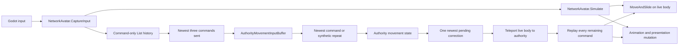
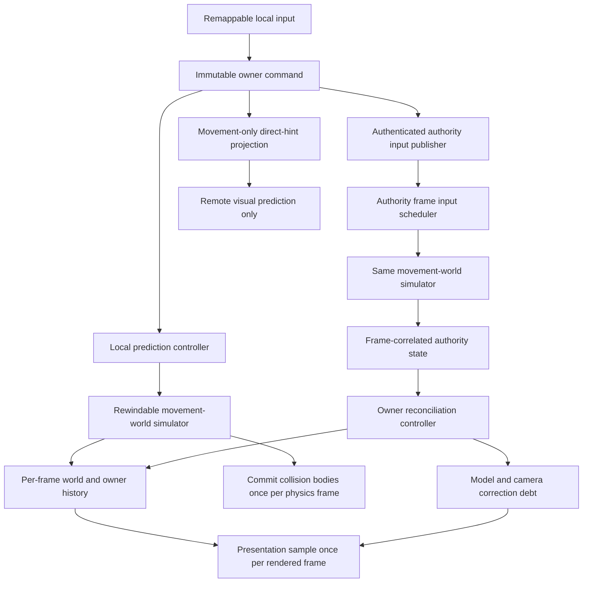

# Local Owner Prediction and Reconciliation Redesign

Status: Proposed architecture and implementation plan; no production behavior changed  
Last updated: August 10, 2026  
Primary bug: `BA-NET-001` in `STEAM_BRAZIL_PLAYTEST_BUG_REPORT.md`

## Executive Decision

Battle Arena should not try to repair the current locally owned client path by
raising packet rates, adding more interpolation, or tuning correction constants.
The transport layer is not the principal failure. The owner-prediction contract
is incomplete.

The recommended replacement is an authority-aligned, fixed-frame prediction
system with:

- immediate local simulation;
- a small adaptive authority input buffer;
- exact frame-correlated authority state;
- complete simulation-state history;
- rewind and simulation-only resimulation;
- durable, identified jump/roll/action transitions;
- an explicit replayable kinematic motor instead of live
  `CharacterBody3D.MoveAndSlide()` rollback;
- separate simulation, visual, animation, and camera state;
- frame-addressed collision-world history with causal contact-island rollback for
  collision-relevant player capsules;
- visual-only use of untrusted direct peer hints;
- quantitative impairment tests and correction telemetry.

This is a substantial rewrite of the owner movement path, but it is not a
whole-project restart. The following foundations should be retained:

- the fixed-tick movement math and most current movement attributes;
- data-driven movement, action, weapon, and presentation definitions;
- ENet and Steam behind `INetworkTransport`;
- Protobuf schemas, validation, sequencing, and channel separation;
- authority clock and path estimators;
- the remote prediction mesh, authentication, and authority fallback;
- the movement-configuration timeline and revision concept;
- server authority over movement, collisions, attacks, hits, damage, and lives;
- local ownership of camera yaw and pitch.

The following parts should be replaced rather than expanded:

- `AuthorityMovementInputBuffer` scheduling semantics;
- the command-only `_predictionHistory` list;
- `NetworkArena.ReconcileLocalPrediction`;
- `NetworkAvatar.ReplayPredictedMovement`;
- hard correction of the body, model, and camera as one transform;
- one-shot attack-lunge velocity mutation;
- independent, accidentally matching client/server action identities;
- render-frame updates to remote collision proxies;
- prediction and presentation responsibilities inside `NetworkArena` and
  `NetworkAvatar`.

The target is not to make the client authoritative. The target is to make the
owner render the current result of its own local simulation while authority is
applied to the correct point in history. Those are compatible goals.

## Experience Contract

The redesign is successful only when these statements are true:

1. Local movement input begins no later than the next local simulation frame.
2. Mouse and camera input remain render-responsive and are never rewound.
3. Ordinary running, sprinting, jumping, crouching, and rolling against static
   arena geometry feel local at high RTT.
4. A correction never advances an animation, sound, particle, or camera effect
   once per replayed frame.
5. Jump and roll press/release transitions are not lost during expected packet
   loss or jitter.
6. Authority state refers to one exact historical simulation frame. It is never
   interpreted by packet arrival time or by an ambiguous sequence alone.
7. The authoritative simulation state is repaired immediately. Only the
   rendered model and camera correction debt are smoothed.
8. Player-player contact remains server authoritative and is predicted from a
   frame-aligned movement world. Untrusted direct peer state never controls a
   collision proxy.
9. Attack movement such as a lunge participates in prediction and replay, while
   hits, damage, and effects remain authority-only.
10. Host and owning-client control policies remain identical. Networking changes
    evidence and correction, not the player's movement rules.

There is one unavoidable qualification: no network model can guarantee that an
interaction with another unpredictable human at 200 ms RTT will never correct.
The goal is to make unopposed owner locomotion feel local, make ordinary
corrections invisible, and make genuine cross-player causality corrections
bounded and understandable.

## What Shipped Games Actually Do

### Rocket League

Psyonix's 2018 GDC presentation,
[It IS Rocket Science!](https://media.gdcvault.com/gdc2018/presentations/Cone_Jared_It_Is_Rocket.pdf),
documents a much stronger model than "predict the car and lerp toward server
positions":

- fixed 120 Hz physics;
- one numbered input for every physics frame;
- a server-side input buffer to absorb arrival jitter;
- client prediction of the interacting physics world;
- history recorded by physics frame;
- authority returned with the client frame it represents;
- comparison against the recorded state for that same frame;
- rewind of the relevant physics actors when the difference is meaningful;
- multiple fixed simulation steps to catch back up;
- presentation of the current predicted result with no input delay;
- 100% server authority.

Psyonix also documents the cost and limitation: 200 ms at 120 Hz can require 24
replayed frames, and predicting an unpredictable car is harder than predicting
the ball. The 120 Hz rate is not the architectural reason the car feels local.
Exact frame identity, buffered input, whole-interaction prediction, history, and
resimulation are the important parts.

This is a verified public description of the shipped architecture in 2018. It
is not proof that every internal detail or tuning value is unchanged in the
2026 product.

### Valve and Source

Yahn Bernier's Valve paper,
[Latency Compensating Methods in Client/Server In-game Protocol Design and Optimization](https://developer.valvesoftware.com/w/index.php?title=Latency_Compensating_Methods_in_Client%2FServer_In-game_Protocol_Design_and_Optimization&uselang=en),
defines the clearest owner reconciliation contract:

- retain every generated user command;
- have the server acknowledge the exact last command it executed;
- return authoritative state after that command;
- start from that authoritative state and replay every later unacknowledged
  command through shared movement code;
- do not replay audiovisual side effects when old commands run again;
- include every prediction-relevant variable in history.

Valve's
[Source Multiplayer Networking](https://developer.valvesoftware.com/wiki/Source_Multiplayer_Networking)
documentation separately describes local prediction, remote interpolation,
prediction-error smoothing, and server hitbox rewind. These are four distinct
problems. They should not be implemented as one generic smoothing system.

### Unreal Engine

Epic's
[Character Movement networking documentation](https://dev.epicgames.com/documentation/unreal-engine/understanding-networked-movement-in-the-character-movement-component-for-unreal-engine?lang=en-US)
uses saved moves, unreliable delivery with resubmission, exact acknowledgements,
correction thresholds, replay, and a separate network-smoothing layer. Special
movement such as leaps and root-motion sources must be represented in saved
move state so it can be reproduced during replay.

Epic's
[Networked Physics overview](https://dev.epicgames.com/documentation/unreal-engine/networked-physics-overview)
describes the more Rocket-League-like model: the predicted client runs ahead,
caches per-frame input and state for at least an RTT, compares authority with
the matching historical frame, rewinds, resimulates to the present, and then
interpolates only the rendered result of any correction.

### Overwatch

Blizzard's GDC material on
[Overwatch Gameplay Architecture and Netcode](https://www.gdcvault.com/play/1024001/-Overwatch-Gameplay-Architecture-and)
and
[Networking Scripted Weapons and Abilities in Overwatch](https://media.gdcvault.com/gdc2017/Presentations/Reed_Dan_NetworkingScriptedWeapons.pdf)
shows why prediction state cannot stop at position and velocity. Fixed command
frames, buffered/redundant input, predicted action state, rollback-aware
variables, animation, movement modifications, teleports, and camera behavior
are treated as coordinated parts of one timeline.

### Godot

Godot's
[physics interpolation documentation](https://docs.godotengine.org/en/stable/tutorials/physics/interpolation/physics_interpolation_introduction.html)
correctly separates fixed physics ticks from rendered frames. Built-in physics
interpolation smooths ordinary fixed-step rendering; it does not supply network
history, restore state, replay inputs, or understand prediction corrections.

`CharacterBody3D` and `MoveAndSlide()` are useful live-character tools, but they
do not expose a complete snapshot/restore contract for floor contact, slide
results, moving bases, recovery, and previous motion. Repeatedly teleporting a
live `CharacterBody3D` backward and invoking `MoveAndSlide()` many times within
one engine physics callback is therefore not an acceptable final rollback
boundary.

### Shared Industry Rule

The common production pattern is:

```text
authoritative state at frame B
    + locally retained inputs for frames B+1 through Current
    -> simulation-only replay
    -> corrected current simulation state
    -> render/camera error offset
    -> visual decay toward the corrected simulation
```

It is not:

```text
new server packet
    -> teleport the currently rendered body
    -> rerun movement and presentation several times
    -> hope interpolation hides it
```

## Current Battle Arena Forensic Audit

### Current Owner Data Flow



The following findings were verified against the current source on August 10,
2026.

| Severity | Confirmed fault | Current evidence | Player-visible consequence |
|---|---|---|---|
| Critical | Authority state is not tied to an exact prediction frame. | `AuthoritativeMovementState` supplies `last_processed_input_sequence`, while `AuthorityMovementInputBuffer` can simulate additional synthetic ticks without changing that sequence. | The owner may replay movement that the returned state already includes, or compare different logical moments. |
| Critical | Authority compaction corrupts logical time. | `ConsumeFreshest()` skips older client ticks but performs one movement integration; stale reuse invents later client ticks with the same sequence. | Acceleration, gravity, roll/jump timers, contacts, and displacement cannot remain equivalent to first-time prediction. |
| Critical | Correction directly moves body, model, and camera. | `NetworkAvatar.ApplyAuthoritativeMovementState()` assigns `Position`; `VisualRoot` and `CameraYaw` are children of that body. | Every routine repair can become a visible snap, especially during a jump. |
| Critical | Replay is not simulation-only. | `ReplayPredictedMovement()` calls `ApplyView()` and `UpdatePresentation()` once per retained command. | A high-RTT correction can advance animation blending many times inside one rendered frame. |
| Critical | The Godot movement state is not fully restorable. | `GodotCharacterMovementDriver.Restore()` restores project state, velocity, and capsule choice, but not the engine's complete floor/contact/slide state. | Replaying stairs, slopes, landings, capsule changes, and dynamic contact can disagree even with identical commands. |
| High | Only three input frames are redundantly sent. | `RedundantInputFrameCount = 3`; authority edge preservation is also three commands. | A jump or roll press/release can disappear during a short burst loss or scheduling stall. |
| High | Attack hold and release never reach authority. | The authority-bound movement bundle is masked by `KnownPredictionMovementButtonMask = 0x7`; Attack is bit 3. Only the separately authorized press is restored. | Hold-to-chain step two and release/press finisher grammar necessarily diverge between owner and authority. |
| High | Attack lunge is not replayable. | A step start mutates velocity once. Replay skips the attack state machine and uses whichever attack step happens to be current. | A correction can remove, duplicate, or distort lunge and attack movement. |
| High | Client life-event gating uses an unpopulated directory. | `_lifeGenerations` is populated on the authority path, while client action/damage/life events are checked against it. | Correct events can be ignored until a later snapshot accidentally repairs state. |
| High | Remote collision proxies are stale and render-driven. | Remote bodies are moved to the latest authority pose from `_Process`, while only their visual roots follow prediction. | Local prediction collides with a latency-old capsule at render-dependent times. |
| High | Local clock synchronization is not a simulation schedule. | The useful authority clock estimator exists, but owner simulation still increments a local `_simulationTick`; `EstimatedAuthorityTick` is not used to schedule authority input. | Packets contain an estimate without creating a shared frame relationship. |
| Medium | Movement revisions are protocol-ready but not live. | Configuration timelines and revision DTOs exist, while Godot movement attributes and live commands are effectively revision 1. | Future item-modified movement would replay against the wrong historical configuration. |
| Medium | Current automated tests prove eventual movement, not feel. | Smoke gates require movement distance, packet arrival, route authentication, and convergence. | They can pass while every correction visibly jerks the owner. |

### Exact Root-Cause Chain

The Brazil result is consistent with the following chain:

1. The local client immediately predicts a full 60 Hz command stream.
2. Only three recent commands are sent in each unreliable bundle.
3. Arrival jitter causes the authority to receive zero or several commands in a
   tick.
4. The authority either repeats a command or chooses the newest command and
   discards the intervening logical frames.
5. Movement timers use the command's client tick even though displacement was
   integrated a different number of times.
6. The authority returns a state labelled by sequence, not by an exact common
   simulation frame.
7. The client treats that state as a valid replay baseline, teleports the live
   body backward, and reruns later commands through incomplete Godot state.
8. The camera and model follow the teleport because they are children of the
   corrected body.
9. Presentation is advanced once for the correction and again for every replay
   step.
10. The next authority packet repeats the process.

This explains why more 60 Hz authority updates can make the problem appear more
continuous but cannot make it correct. More frequent ambiguous corrections are
still ambiguous corrections.

### What Is Not the Primary Cause

The following work is useful and should not be discarded, but none of it repairs
the owner path by itself:

- the 60 Hz authority movement stream;
- the 30 Hz broader snapshot stream;
- the direct client-to-client prediction mesh;
- adaptive remote-player presentation delay;
- authority clock estimation;
- Steam Datagram Relay or ENet selection;
- raising rendering FPS;
- changing physics from 60 Hz to 120 or 144 Hz.

The direct mesh improves how one client sees another client. The local owner
already has its own input immediately. Its problem is incorrect authority
correlation, replay, and presentation repair.

## Target Architecture

### Architectural Choice

Battle Arena will use an authority-aligned global simulation-frame domain. A
client predicts a configurable number of fixed frames ahead of the authority.
Each local command names the future match frame it is intended to control. The
authority consumes exactly one command decision for each player on each match
frame, then returns state bearing that exact frame identity.

This choice is stronger than a sequence-only Source-style controller because
Battle Arena keeps player-player collision and will later add movement-affecting
objects and abilities. All collision-relevant actors need a common historical
time domain.

### High-Level Structure



### Four Separate Planes

1. **Simulation plane** owns deterministic movement/action state and collision
   queries at a fixed step.
2. **Authority plane** carries authenticated commands, frame scheduling,
   authoritative states, action resolutions, and configuration revisions.
3. **Prediction plane** owns history, comparison, rewind, resimulation, input
   redundancy, and direct remote hints.
4. **Presentation plane** owns model transforms, animation, camera correction,
   audio, VFX, and UI. It consumes simulation results but never changes them.

No class should be allowed to collapse these four planes back into one
`NetworkArena` method.

## Simulation Identity and Time

### Typed Identities

The current code overloads `ulong` values and treats a command sequence as a
simulation time. The replacement uses distinct value types:

| Identity | Meaning | May it be used as simulation time? |
|---|---|---|
| `SimulationInstant` (match frame) | The existing core-wide fixed tick, interpreted inside the current match-frame epoch. Movement, combat, and effects use the same clock. | Yes. |
| `MatchFrameEpochId` | Identifies the authority's current match-frame numbering epoch. | No. |
| `InputSequence` | Monotonic owner-to-authority delivery and deduplication identity. | No. |
| `PacketSequence` | Transport packet ordering/loss identity. | No. |
| `PredictionRouteAttemptId` | Identifies a mesh connection retry whose packet numbering restarts within an authorized route generation. | No. |
| `MovementTransitionId` | Exact-once jump, roll, crouch-profile, or traversal transition intent for one life. | No. |
| `PredictedActionId` | Client-created correlation identity for an attack/item action prediction. | No. |
| `AuthorityActionExecutionId` | Authority-owned accepted gameplay execution. | No. |
| `TransitionResolutionSequence` | Monotonic terminal-result cursor for the movement-transition journal. | No. |
| `ActionResolutionSequence` | Monotonic terminal-result cursor for the predicted-action journal. | No. |
| `LifeEpoch` | `(CombatantId, LifeId)` pair that rejects delayed prior-life input and state. | No. |
| `AuthorityDiscontinuityId` | Authority-owned spawn, respawn, teleport, or level-transition generation for one combatant. | No. |
| `OwnerControlEpoch` | Authority-issued generation for initial control, reconnect, or an owner-timeline restart; rejects commands from an older control session. | No. |
| `LocalPredictionRebaseId` | Client-only history/presentation repair generation. It is never presented as authority state. | No. |
| `MovementConfigurationRevision` | Immutable compiled movement values effective on a declared frame. | No. |
| `MovementCapabilityRevision` | Immutable movement capabilities effective on a declared frame. | No. |

Approximate synchronized time is useful for deciding which future frame a
client should predict. It is never accepted as proof that an incoming state is
the baseline for a particular history entry.

`SimulationInstant`, `SimulationDuration`, and `SimulationRate` already exist in
`BattleArena.Core.Common`; this design reuses them. "Match frame" in this
document is a semantic label for `SimulationInstant.Tick`, not a second movement
clock. The match-frame epoch/session makes a reused tick value unambiguous after
a true authority timeline reset.

Match ticks are nonnegative and converted to/from the unsigned wire field with
checked validation. Effects, movement, action phases, and authority frame order
therefore advance from the same `SimulationInstant`; adapters may not maintain a
second hidden `clientTick` clock for gameplay duration.

### Match Frame Epoch

At match start the authority publishes:

- match/session ID;
- match-frame epoch ID;
- current `SimulationInstant` match frame;
- negotiated fixed simulation rate;
- authority monotonic timestamp captured at the frame boundary;
- initial movement/capability configuration revisions;
- the client's initial target prediction lead.

The authority records its monotonic timestamp at every physics boundary. Clock
sync replies refer to one of those recorded boundaries instead of sampling an
integer tick at an arbitrary callback time.

The current `AuthorityClockSynchronizer` remains useful for estimating frame
position, drift, and RTT. A new prediction scheduler converts that estimate into
whole fixed simulation steps. It does not vary the movement `delta`.

### Bootstrap, Reconnect, and Timeline Rebase

A future-frame predictor cannot begin by relabelling its first local step
`currentAuthorityFrame + lead`. That would leave missing intervening history and
cause the authority to simulate fallback frames the client never represented.
Bootstrap is an explicit protocol:

1. Because the current game starts only after all players join, the authority
   selects one future `LocalInputEnableFrame E` far enough ahead for clock sync,
   route setup, lead-policy publication, and a safety margin. The countdown/UI
   enables control for everyone when their synchronized authority estimate
   reaches `E`; high-ping players do not see the match start early.
2. For owner lead `L`, authority publishes
   `FirstCommandTargetFrame T = E + L`, the lead revision, configuration
   revisions, collision-content hash, and an exact frozen baseline for `T - 1`.
   Pre-match gameplay/effects are frozen, so this future baseline is known rather
   than guessed.
3. Authority applies declared frozen/neutral control to that combatant through
   `T - 1`. It never claims to have received a client command for those frames.
4. At synchronized enable frame `E`, the client loads the `T - 1` baseline,
   simulates `T` immediately with current local input, renders that prediction,
   and sends the future command. Thus local response starts with the common
   countdown while authority receives enough lead time.
5. Every subsequent predicted/history frame is contiguous from `T`. Authority
   later reaches and consumes those exact numbered frames. The owner state for
   `T` is the first normal reconciliation baseline.

Reconnect cannot assume a future dynamic-world pose is knowable. It uses a
two-step handshake:

1. Authority increments `OwnerControlEpoch`, applies declared neutral control,
   and sends a complete current/past baseline `B` plus a future
   `ResumeInputEnableFrame E` and `FirstCommandTargetFrame T`.
2. The client acknowledges, restores `B`, and builds explicit neutral frames
   `B + 1 ... T - 1` from authority world history plus the documented trusted
   remote fallback. Those frames are marked bootstrap/speculative, not accepted
   authority.
3. At `E`, local input begins on `T`; authority continues its recorded neutral
   decisions until `T`. The first returned owner/world baseline corrects any
   dynamic-contact difference in the seeded interval.

Respawn uses the same control-epoch process from its exact spawn baseline. Spawn
selection must be clear of players so the short neutral seed is normally
unambiguous. The client never relabels a newly received old state as current.

Lead changes are also frame-effective:

- `PredictionLeadUpdate` declares the new lead and a future effective frame
  beyond commands already scheduled in the authority buffer.
- Growing lead uses a rare two-step callback, producing two consecutive history
  frames. A pressed/released edge belongs to the first eligible step; complete
  held state is sampled for both.
- Shrinking lead uses a rare zero-step callback. Rendering and camera input
  continue while no simulation frame is skipped or relabelled.
- Existing queued commands retain their target frames. A lead update never
  rewrites their identities.
- If clock confidence, buffer occupancy, or required correction exceeds policy,
  the authority schedules an explicit `TimelineRebase` rather than making a
  large implicit 0/2-step adjustment. The authority issues a new
  `OwnerControlEpoch`, baseline, and future resume frame. A local history repair
  increments only `LocalPredictionRebaseId`; it never invents an
  `AuthorityDiscontinuityId`.

This protocol keeps history contiguous through startup, drift correction,
reconnect, and recovery.

Input sampling during pacing changes is explicit:

- a zero-step callback still samples camera and controls into a pending input
  accumulator, but creates no command and consumes no transition;
- the next actual simulation step uses the newest continuous state plus every
  still-valid durable transition accumulated since the prior step;
- a two-step callback samples controls once; the first command contains that
  sample and any newly originating transition/action references, while the
  second command repeats only continuous/held intent and has no invented edge;
- each produced command receives its own consecutive target frame and input
  sequence;
- render-rate input events enter durable journals immediately, so a quick
  press/release during a zero-step callback cannot disappear.

Lead feedback is an absolute, revisioned policy, never an increment/decrement
message. `PredictionLeadUpdate` contains `target_lead_frames`, a monotonic
`lead_policy_revision`, and a future `effective_frame`. Duplicate updates are
idempotent; an older revision is ignored.

### Listen-Server Local Owner

The listen-server host must not drive the same `CharacterBody3D` that represents
authority truth while remote owners use a separate prediction timeline. The
selected design is:

- the host has the same `LocalMovementPredictionController`, owner history,
  visual anchor, camera anchor, cue ledger, and reconciliation path as a remote
  client;
- host commands use an in-memory `IAuthorityOwnerCommandPublisher` but still
  target future frames and pass through `AuthorityOwnerInputScheduler`;
- the authoritative host combatant has a distinct simulation state/body from
  the host's predicted presentation state;
- only the authority body participates in the authority physics/combat facade;
  the host predictor uses query-only collision state and cannot collide with its
  own authority capsule;
- the host uses the same minimum lead/buffer policy, durable transitions, action
  correlation, collision-world history, and correction telemetry;
- no artificial network loss is added to the host, so it will naturally have
  fewer corrections, but it receives no special movement or hit-validation
  rules.

This removes code-path and simulation-order advantage. It cannot remove the
physical fact that a local command reaches authority sooner; the combat section
defines one bounded historical-validation equation for host and remote attacks
and measures the remaining outcome bias explicitly.

### Prediction Lead and Authority Input Buffer

The owner predicts ahead of the authority far enough that an input normally
arrives before its target authority frame:

```text
target lead ticks =
    ceil(smoothed one-way delay / fixed step)
    + ceil(jitter safety / fixed step)
    + small server buffer target
```

Initial policy:

- server buffer target: two frames;
- jitter safety: smoothed jitter plus one standard safety margin, clamped;
- lead minimum: two frames;
- lead maximum: a policy derived from the supported RTT, initially 24 frames at
  60 Hz and 48 frames at 120 Hz;
- lead changes: gradual, with at most an occasional zero-step or two-step local
  scheduling decision;
- physical step size: always exactly `1 / negotiatedSimulationRate`.

The client normally performs one prediction step per Godot physics callback.
If drift or buffer feedback requires correction, the scheduler very
occasionally performs zero or two fixed simulation steps. Render interpolation
and correction presentation hide the pacing adjustment. Mouse/camera sampling
continues every render frame and is not paused.

The system must expose the actual server input-buffer occupancy and predicted
lead. It must not infer buffer health only from RTT.

### Why the Input Buffer Is Worth Its Latency

A two-frame server buffer adds a small authority-side delay, but the owner still
responds immediately. The buffer prevents jitter from continually forcing the
server to alternate between stale reuse and input bursts. This is the same
fundamental trade-off Psyonix documented: too little buffer starves; too much
buffer adds needless latency.

The buffer should be adaptive, not elastic without bounds. At high RTT, most of
the prediction lead pays for network travel; only the small safety target is
intentional buffering.

## Owner Command Model and Delivery

### One Immutable Sample, Two Explicit Projections

Input sampling produces one immutable Multiplayer orchestration object composed
from a Core-owned simulation value:

```csharp
public readonly record struct OwnerSimulationCommand(
    OwnerInputIdentity Identity,
    AuthorityDiscontinuityId AuthorityDiscontinuity,
    SimulationInstant TargetFrame,
    CharacterSimulationInput Input);

public readonly record struct CharacterSimulationInput(
    MovementAxes Movement,
    ViewOrientation View,
    MovementHeldState MovementHeld,
    TransitionReferenceBuffer TransitionReferences,
    CombatInputState CombatInput,
    ActionReferenceBuffer ActionReferences,
    MovementConfigurationRevision MovementRevision,
    MovementCapabilityRevision CapabilityRevision);
```

`OwnerSimulationCommand` lives in Multiplayer because it carries session,
delivery, life/control, and discontinuity identity. `CharacterSimulationInput`,
its quantized axes/view and held-state values, typed configuration revisions,
and fixed-capacity reference buffers live in Core. The Core simulator therefore
does not depend outward on networking. Frame identity remains in the explicit
`SimulationStepContext`; the Multiplayer command's target frame is checked
against that context before simulation.

Two different mappers consume it:

- `IAuthorityOwnerCommandPublisher` sends the complete authenticated command to
  the host, including the combat input grammar required by the weapon policy.
- `IRemoteMovementHintPublisher` creates a movement-only direct-peer hint that
  structurally cannot contain attack, item activation, hit, damage, health, or
  other gameplay authority.

The current practice of cloning one protocol object and masking bits is removed.
The interface-segregated projections make it impossible to accidentally strip
Attack hold/release from the authority copy or leak combat intent into the mesh.

### Continuous Input

Axes, view orientation, and held movement state are complete per-frame intent.
They use unreliable delivery with application sequence numbers, but target
frames are not replaceable in the authority scheduler. A newer command describes
a newer frame; it never substitutes itself into an older missing frame. Only the
authority's declared fallback policy supplies intent for a missed deadline.

The client retains a deadline-aware sliding window. Every packet prioritizes:

1. the contiguous unconsumed target-frame range nearest the authority's next
   expected frame;
2. newly generated future commands;
3. still-live gaps indicated by selective receive acknowledgements;
4. unconsumed commands containing a discrete transition;
5. the outstanding transition/action journal.

The initial recent window should cover at least 100 ms and adapt upward for
measured burst loss, subject to the 1,200-byte movement datagram budget. At 60
Hz this begins at six commands, not three. The exact encoded maximum must be a
test, not an estimate.

The authority returns both:

- `highest_contiguous_input_sequence_received` plus a selective acknowledgement
  mask for delivery cleanup;
- `consumed_through_match_frame` plus bounded terminal dispositions for received,
  fallback, rejected, and late target frames;
- `input_sequence_applied_on_this_frame` for diagnostics and correlation.

Received is not the same as simulated. Neither is a substitute for the returned
`SimulationInstant` match frame.

Once the authority has consumed target frame `F`, the client removes ordinary
command `F` from the send window even if it was never received. A late copy
cannot help and is not resent forever. Durable transition/action identities from
that command remain advertised independently until they receive a terminal
resolution or expire under their authored policy.

Commands reference durable journal IDs; they do not carry another complete copy
of every outstanding intent. An owner batch contains each outstanding transition
or action intent at most once, regardless of how many command frames reference
it. A command records only IDs originating/relevant on that frame so tick-local
compatibility input can be reconstructed deterministically.

Journal cleanup is cursor-based and bounded per `LifeEpoch` and
`OwnerControlEpoch`:

- movement-transition and predicted-action terminal results use distinct monotonic
  `TransitionResolutionSequence` and `ActionResolutionSequence` cursors;
- authority batches repeat only results newer than the client's acknowledged
  resolution cursor, plus a bounded selective mask when gaps exist;
- the client applies results idempotently and returns its highest contiguous
  transition/action resolution cursors in every owner batch;
- the authority retains a terminal tombstone until acknowledged, life/control
  epoch end, or a bounded retention timeout followed by a required baseline
  repair;
- reconnect/bootstrap state supplies current journal cursors and active
  transition/action state rather than replaying an entire prior-life log;
- per-peer journal counts and intent rates are hard-bounded and validated, so a
  malicious client cannot force unbounded memory.

### Durable Movement Transitions

Jump press/release, roll press/release, crouch-profile transitions, ledge grab,
climb/drop, and future movement capabilities must not rely on one transient bit
surviving three packets.

Each discrete transition has:

- a per-life monotonic `MovementTransitionId`;
- transition kind;
- first predicted frame;
- bounded validity/deadline policy;
- any immutable authored parameters required for validation;
- accepted, rejected, expired, or superseded resolution.

The client repeats unresolved transitions in its unreliable input packets until
the authority acknowledges a terminal result. The authority processes each ID
at most once. Repeating a held command during buffer starvation never invents a
new press.

Examples:

- A jump press is predicted immediately at frame 1204 and advertised as
  transition 77 until accepted or rejected.
- A jump release may be transition 78 and is applied once to the jump-cut
  policy.
- A roll press is transition 79. Holding crouch/roll remains continuous input;
  the original transition is not retriggered.

The authority echoes the actual application frame. If a transition arrived too
late and policy permits it to move to the next legal frame, that remap is
explicit and causes a normal historical correction. It is never silently
inserted into an already simulated frame.

### Combat Input and Actions

Attack gameplay remains authority-only, but the owner's presentation and any
movement influence are locally predicted.

The complete authority command stream must carry Attack held/pressed/released
grammar because the starter sword's authored policy uses all three. In addition:

- each locally initiated action receives `PredictedActionId`;
- the authority accepts or rejects that correlation ID;
- an accepted action receives a distinct `AuthorityActionExecutionId` and exact
  start frame;
- action resolutions are sent immediately and repeated in repair state;
- duplicate requests are idempotent;
- attack hit candidates, damage, and effects are never accepted from the
  client.

This fixes two current issues at once: hold/release parity and accidental
client/server execution-ID alignment.

### Action Frame and Melee Historical Validation

Movement prediction and melee lag compensation share time identities but remain
different systems. The initial protocol-next rule is:

1. A local attack intent identifies `PredictedActionId`, owner control/life
   epochs, originating input sequence, predicted start frame `F`, and the
   authority frame represented by the attacker's rendered remote-world view when
   the intent began.
2. If the intent arrives legally before `F`, authority accepts it on `F`. If it
   arrives late but the immutable weapon policy permits a small remap, authority
   names the earliest legal replacement frame explicitly; otherwise it rejects
   it. Receipt time never silently becomes action time.
3. The accepted action state and lunge start on the same frame `F`. Every active
   hit window is an authored offset from that accepted start frame.
4. On active authority frame `H`, the attacker's sweep comes from its current
   authoritative `H` pose and authored weapon path. Only eligible defender
   hurt-proxy history is sampled historically.
5. For an attack-frame offset `d = H - F`, the requested defender frame advances
   from the validated rendered-world frame by `d`. Authority clamps it to
   available history and to approximately half its own smoothed RTT plus jitter,
   with the already-confirmed absolute 200 ms cap. Client-declared ping cannot
   increase the allowance.
6. Current authority static-world obstruction, ownership, life, action phase,
   reach, arc, cooldown, and hit-deduplication rules still apply. Damage/effects
   occur on `H`; health and movement history are not rewound.

The claimed rendered-world frame is evidence, not trust. Authority checks it
against clock synchronization, the negotiated remote-presentation delay, its
measured path, the action's target frame, retained history, and the rewind cap.
The host-local predictor supplies the same field from the same presentation
timeline and goes through the same equation; it does not call a special
current-frame hit method.

This plan therefore does not claim that smoother locomotion alone fixes
`BA-NET-003`. Phase 8 must run role-swapped host/remote attacks with compensation
enabled, disabled, and capped at multiple values, recording requested/granted
rewind, attacker pose, defender frame, obstruction result, and hit outcome. A
systematic host or remote advantage blocks rollout even if movement looks good.

### Authority Frame Consumption

`AuthorityMovementInputBuffer.ConsumeFreshest()` is replaced by an
`AuthorityOwnerInputScheduler` keyed by target match frame.

For authority frame `F`, it performs exactly one of these decisions for each
active combatant:

1. **Received:** consume the validated command explicitly targeting `F`.
2. **Repeated continuous:** if `F` is missing but still within the short stale
   policy, reuse only axes/view/held state from the previous frame. Use no press
   or release transitions.
3. **Neutral fallback:** after the stale policy, use neutral movement while
   preserving safe view/facing state.
4. **Authority override:** eliminated, stunned, teleported, or another
   authority policy supplies a declared command/state override.

The decision is recorded as `InputApplicationKind` in telemetry and returned
owner state. Once frame `F` has been consumed, a late command targeting `F` is
never simulated later. It is recorded as late and discarded. This guarantees:

- no client frame is integrated twice;
- no logical timer advances by four while displacement advances by one;
- no late real command follows a synthetic version of the same frame;
- no FIFO backlog becomes permanent movement latency;
- no newest-command compaction silently deletes simulation time.

An authority wall-clock hitch does not itself permit skipped simulation frames.
The fixed-step loop runs at most `MaxAuthorityCatchUpSteps` per engine callback
and otherwise remains temporarily behind wall time while preserving every frame.
Lead controllers observe that drift but do not relabel history. If the authority
falls beyond a measured `MaxRecoverableAuthorityLag`, would overrun required
history, or cannot catch up within the session policy, it pauses/freeze-controls
the affected match, emits one reliable `AuthorityTimelineReset` with a new
match-frame epoch and future resume baseline, and resumes explicitly. A single
client's missing input uses that client's declared fallback; it never resets the
global timeline. Silent time compression and incrementing a frame without
simulation are prohibited.

### Canonical Authority Frame Pipeline

A shared frame number is useful only with one shared order. Starting with the
complete post-state of frame `F - 1`, authority frame `F` executes:

1. Drain network evidence already queued before the fixed-frame boundary.
2. Apply reliable life, equipment, effect, movement-configuration, and
   capability changes whose authority effective frame is `F`.
3. Resolve exactly one owner-input decision per combatant, deduplicate movement
   transitions, and accept/remap/reject action intents targeting `F`.
4. Advance action state for `F` and construct movement sources. An action
   accepted to start on `F` contributes its authored lunge on `F`.
5. Sample persistent sources/configuration and solve the complete character
   movement world from `F - 1` to `F`.
6. Commit final collision/hurt-proxy transforms for every combatant once. Combat
   queries in this same frame observe these committed `F` transforms, never a
   partially committed avatar order.
7. Evaluate active attack volumes and other authority interactions for `F`,
   using the bounded historical defender policy where the action permits it.
8. Resolve hits, damage, healing, deaths, and simultaneous outcomes. A
   knockback/pull created by a hit on `F` becomes a movement source effective on
   `F + 1`, because movement for `F` is already complete. An action-start lunge
   is different: it was accepted before movement and begins on `F`.
9. Finalize identified events, owner reconciliation states, compact movement
   world, and lower-cadence checkpoints for outbound publication.

The client prediction kernel follows the same order through movement and action
state but does not execute steps 7-8 as gameplay authority. It may emit an
idempotent predicted cue; it never creates an accepted target, damage, health,
or death result.

An input's claimed movement/capability revision is diagnostic validation, not a
reason to discard otherwise legal axes or held intent. Authority always resolves
the immutable canonical revision effective at target frame `F`, simulates with
it, records any mismatch, and returns the canonical revision. A transition or
action may still be rejected when the canonical capability says it is illegal.
If a client receives an owner baseline before it has the referenced definition,
it queues the baseline and requests/awaits the reliable configuration update;
only a bounded configuration-history miss causes an explicit owner rebase.

## Complete Rewindable State

### Aggregate State

The unit of rollback is not `Position + Velocity`. It is a complete
`CharacterSimulationState`:

```csharp
public readonly record struct CharacterSimulationState(
    LifeEpoch Epoch,
    AuthorityDiscontinuityId AuthorityDiscontinuity,
    OwnerControlEpoch ControlEpoch,
    SimulationInstant Frame,
    CharacterKinematicState Kinematic,
    MovementRuntimeState Movement,
    CharacterActionState Action,
    CollisionContactState Contact,
    CollisionProfileState CollisionProfile,
    MovementSourceBuffer MovementSources,
    MovementConfigurationRevision MovementRevision,
    MovementCapabilityRevision CapabilityRevision,
    DeterministicCounterState Counters);
```

At minimum it contains:

- world position;
- horizontal and vertical velocity;
- body facing;
- locomotion, posture, jump, roll, traversal, and action modes;
- mode/action instance identity and start frame;
- coyote, input-buffer, roll-duration, cooldown, and other tick timers;
- jump count and authored air-action counts;
- grounded state, floor normal, stable surface identity, and moving-base identity
  or `None`;
- body-relative transform on an explicitly supported moving base;
- current capsule/profile identity and dimensions;
- attack/action phase, predicted action ID, authority execution ID if known,
  committed facing, and combo state;
- replayable movement sources such as roll boost, attack lunge, knockback, pull,
  dash, and future item movement;
- accumulated external impulses not yet consumed;
- exact movement and capability revisions;
- any deterministic counter or authored random sample that can affect future
  movement.

Health, damage resolution, item selection, and effect execution do not become
client authority. A movement-affecting result of an authoritative effect enters
the simulation as a frame-stamped movement configuration update, capability
update, or movement source.

`CharacterActionState` contains only the predicted/confirmed action phase and
movement consequences needed to reproduce locomotion. It explicitly does not
contain an authority hit ledger, accepted targets, resolved damage, health, or
effect outcomes. Replaying owner movement can therefore never replay a hit.

### Prediction History Entry

These declarations communicate ownership and domain shape; they are not a
license to allocate an object graph every tick. Runtime state uses compact value
types, preallocated bounded ring storage, fixed-capacity inline buffers where
practical, and explicitly owned pooled slabs only when the measured maximum
cannot fit inline. Published frames are semantically immutable after insertion.
An `IReadOnlyList` wrapper over a mutable list is not considered immutable.

Initial wire/runtime safety bounds are 16 concurrent movement sources, four
gameplay-relevant contact facts, 16 transition references, 8 action references,
and 16 identified simulation events per character frame. Phase 1 measures real
content and memory before those become protocol constants. Multiplayer content
validation rejects a definition/loadout whose non-aggregatable worst case can
exceed the negotiated limits; ordinary attribute modifiers compile into a
revision rather than consuming one transient source slot.

Each `OwnerPredictionFrame` stores:

- frame, life, authority discontinuity, owner-control epoch, and local rebase
  identity;
- immutable owner command;
- transition/action IDs referenced by that command;
- exact pre-step state;
- exact post-step state;
- collision query/contact summary;
- movement/capability revision;
- deterministic simulation events with stable IDs;
- compact state hash for diagnostics;
- whether the frame was first-run or later replayed;
- optional replay cost/correction metadata.

History is a bounded ring, not a shifting `List`. Capacity is based on a time
policy:

```text
supported RTT
+ authority send interval
+ maximum jitter/loss burst
+ scheduling margin
+ diagnostic margin
```

An initial two seconds of state history, rounded up to a power of two with a
minimum of 256 frames, is inexpensive for at most eight compact character
states and comfortably exceeds the expected correction horizon. A separate
hard replay-depth policy prevents one malformed or extremely late packet from
causing unbounded work.

### Diagnostic Canonical Hash

`CanonicalMovementStateHashV1` is diagnostics only. It may locate the first
divergent frame/field, but it never authorizes a client, replaces field
comparison, or independently triggers a hard snap.

Its contract is versioned and explicit:

- fields are written in a declared order into a reusable little-endian buffer;
- finite numeric simulation fields use the same declared integer quantization
  as comparison/wire canonicalization, never raw platform float bytes;
- bounded sources/events are sorted by stable domain identity before encoding;
- it includes match-frame epoch, simulation tick, life, authority
  discontinuity, control epoch, kinematic/discrete state, canonical revisions,
  and gameplay-relevant support/contact behavior;
- it excludes local prediction rebase IDs, packet/arrival metadata, Godot RIDs,
  process instance IDs, raw static manifold ordering, presentation state,
  unknown Protobuf fields, and Protobuf serialization order;
- a named fixed algorithm (initially `XxHash64`) and hash-schema version travel
  with traces/diagnostics.

Changing quantization or included fields creates `V2`; it never silently changes
the meaning of an existing hash.

### Tick-Effective Configuration

The existing `MovementConfigurationTimeline` is retained and wired into every
first-time and replay step. History resolves the immutable configuration and
capability revisions effective on that exact match frame.

This is required before item-modified multiplayer movement. A chestplate that
changes jump gravity or an ability that changes poison-related movement cannot
cause current attributes to be retroactively applied to old prediction frames.

Policy nature remains immutable. Only compiled values and explicitly authored
capabilities change at declared frames, matching the broader game architecture.

## Reproducible Godot Kinematic Motor

### Decision

Battle Arena should stop treating live `CharacterBody3D.MoveAndSlide()` as the
rollback simulator. It should build an explicit-state capsule motor that queries
Godot collision from supplied poses and returns a new state without moving the
live node.

This is deliberately called **reproducible prediction**, not guaranteed
bit-deterministic rollback. Godot's floating-point collision queries can differ
slightly across hardware, operating systems, and engine builds. Reconciliation
remains normal. True bit-deterministic rollback would require a separate
fixed-point collision world and is not justified for this game now.

### Required Interfaces

The core owns query-neutral contracts:

```csharp
public interface ICharacterMovementSimulator
{
    CharacterSimulationStepResult Step(
        CharacterSimulationState state,
        CharacterSimulationInput input,
        MovementAttributeSnapshot attributes,
        MovementCapabilitySnapshot capabilities,
        ICharacterCollisionWorld collisionWorld,
        SimulationStepContext context);
}

public interface ICharacterCollisionWorld
{
    CapsuleSweepResult SweepCapsule(CapsuleSweepRequest request);
    GroundProbeResult ProbeGround(GroundProbeRequest request);
    ClearanceResult CheckClearance(ClearanceRequest request);
    SupportMotionResult GetSupportMotion(SupportMotionRequest request);
}

public interface IMovementWorldSimulator
{
    MovementWorldStepResult Step(
        MovementWorldState state,
        MovementWorldCommandBuffer commands,
        ICharacterCollisionWorld staticCollisionWorld,
        SimulationStepContext context);
}
```

The character simulator resolves one character against static/query geometry.
The movement-world simulator coordinates character steps, player-pair
constraints, and dependency/contact journals. Both return state and facts. They
do not call a Godot node, send a packet, play an animation, change health, or
dispatch an effect.

The Godot project implements `GodotKinematicCollisionWorld` with explicit-pose
queries such as `PhysicsServer3D.BodyTestMotion()` and/or equivalent direct-space
shape casts. Standing, crouching, and rolling query bodies/shapes are prepared
up front. A replay switches an explicit collision-profile identity; it does not
resize the visible capsule repeatedly.

The technical design uses separate pre-created query RIDs for every supported
capsule profile. They are query-only kinematic bodies registered once in the
active `World3D.Space`; their collision layer is zero/nonparticipating, their
query mask includes only the authored static/query layer, and every live player,
hurtbox, trigger, dynamic facade, and remote-proxy RID is excluded. They are not
the visible `CharacterBody3D` RIDs and are never committed as scene transforms.
The explicit player-pair solver therefore owns player collision exactly once.
The query world never sees a current-time remote body while evaluating a
historical frame.

The adapter preallocates and reuses request/result objects and bounded contact
buffers. The first implementation runs all Godot space queries on the fixed
physics thread; any later job-system work must keep Godot calls behind a legal
serialized adapter and may parallelize only pure state/math work.

This boundary must pass an early technical spike before the motor rewrite is
committed. The spike verifies that:

- explicit `From` transforms work for long historical query sequences without
  committing query-body transforms;
- multiple queries within one Godot physics callback are legal and stable;
- standing/crouching/rolling query RIDs return equivalent geometry behavior;
- live dynamic bodies are completely excluded;
- query results remain stable for the movement test course;
- final authority facade commits are observable to same-frame combat queries;
  if Godot space synchronization does not guarantee that, hit tests consume the
  explicit committed transform/hurt-shape data directly rather than querying a
  stale physics-space transform;
- request/result buffers are reusable without stale collision data;
- worst-case sweep/step counts and CPU cost are acceptable.

If `BodyTestMotion` cannot meet those gates, the fallback is direct shape queries
through `PhysicsDirectSpaceState3D` behind the same interface, not a return to
live-node rollback.

Static collision identity comes from an authored/baked manifest, never a Godot
RID or process-local instance ID. The build assigns stable `StaticColliderId`
and `StaticShapeId` values and computes a collision-content hash. Join/start
handshake rejects a mismatched collision hash. Contact comparison uses stable
support identity where support matters and applies quantized-normal/seam
hysteresis so crossing two equivalent coplanar shapes does not manufacture a
topology correction.

The existing `GodotGroundMotor` contains useful sweep and step-selection ideas.
Those rules should be extracted and made state-returning instead of mutating the
live body.

### One Fixed Character Step

The explicit motor performs this ordered algorithm:

1. Validate life, authority-discontinuity, owner-control, frame, and
   configuration identities.
2. Deduplicate and resolve durable movement transitions.
3. Resolve crouch/roll profile changes and standing clearance.
4. Advance movement state, action state, support motion, gravity, jump, roll,
   attack lunge, knockback, and other movement sources.
5. Produce desired fixed-step displacement.
6. Sweep the selected capsule from the state's supplied pose.
7. Resolve a bounded number of slide contacts in deterministic order.
8. If a grounded planar obstruction qualifies, attempt explicit up, forward,
   and down step sweeps.
9. Accept a step only when upward clearance succeeds, forward progress improves,
   the landing is within authored height, and the landing normal is walkable.
10. Disable ground snap while rising; otherwise perform an explicit bounded
    ground probe/snap.
11. Resolve ceilings, walkable slopes, edge departure, and bounded penetration
    recovery.
12. Resolve player-capsule constraints through the movement-world solver.
13. Canonicalize finite values and any configured comparison quantization at the
    frame boundary.
14. Return the new complete state, stable contact facts, and deterministic
    simulation events.

Contact selection uses a stable ordering such as:

1. quantized travel fraction;
2. stable static-surface or network entity identity;
3. stable shape identity;
4. quantized contact normal.

This does not make the Godot physics engine deterministic, but it prevents node
iteration and unordered result traversal from creating avoidable differences.

### Live Body Commit Rule

During one real Godot `_PhysicsProcess()` callback:

1. drain already-decoded network evidence into application queues;
2. process any authority correction through state-only replay;
3. run the required zero, one, or two prediction frames;
4. commit the final collision transform/profile once;
5. publish one final simulation sample to presentation;
6. emit only first-run cues not already present in the cue ledger.

The live body, hitboxes, model, and camera are never marched through historical
poses during reconciliation.

No physics collision body is moved from `_Process()`. Render processing may move
visual-only nodes.

Transport adapters timestamp packets when received and enqueue immutable inbound
evidence. Simulation/application state consumes that queue only at the start of
a fixed physics frame. ENet/Steam callback pumping may remain in a required
engine callback, but it cannot mutate movement state at render-dependent points.
Where the adapter permits explicit polling, the composition root pumps it before
the fixed-frame drain.

### Fixed Rate

The hard-coded `NetworkArena.FixedDelta = 1 / 60` is removed. One negotiated
`MatchSimulationClock` owns:

- simulation rate;
- fixed duration;
- current authority/prediction frame;
- frame-boundary monotonic timestamps;
- prediction lead and scheduler state.

Godot's configured physics tick rate is asserted against the negotiated match
rate. Content durations remain integer-frame schedules compiled from authored
seconds through the existing explicit rounding policy.

Correctness is implemented and tuned at 60 Hz first. After the replay and
presentation gates pass, benchmark 120 and 144 Hz. A 120 Hz target has a clear
industry precedent and halves the maximum local fixed-step response from 16.7
ms to 8.3 ms. A higher rate should be adopted only after CPU, bandwidth, replay
depth, Windows/Linux parity, and actual feel are measured. It must not be used
to conceal an incorrect 60 Hz predictor.

## Movement World and Player Collision

### Why Player Collision Changes the Problem

An owner replayed against a remote player's latest received capsule is not
replaying the same world the authority used. Replaying against the remote
player's interpolated visual pose is also wrong. Psyonix's presentation
explicitly identifies this two-timeline collision problem.

Battle Arena has already decided that players collide. The final prediction
architecture therefore includes a small rollback movement world rather than
pretending each avatar can be reconciled independently.

This is an explicit proposed reversal of two previously confirmed assumptions:

- `MULTIPLAYER_ARCHITECTURE.md` limits prediction to the local character and
  rejects full-world rollback.
- `REMOTE_MOVEMENT_PREDICTION_ARCHITECTURE.md` keeps the owner colliding against
  the newest authority-confirmed remote proxy.

The Brazil playtest and fresh audit show that those policies cannot provide
frame-correct solid player contact. Phase 9 must not begin until the user
explicitly approves this reversal. If it is not approved, the honest
alternative is static-world-only owner prediction with client-side player
blocking disabled/softened and visible authority contact corrections; retaining
hard collision against a latency-old proxy is not recommended.

### Authority Movement World

On each match frame the authority:

1. obtains one declared input decision per active combatant;
2. calculates every combatant's provisional static-world-resolved motion;
3. resolves player capsule pairs with symmetric constraints in stable
   `CombatantId` order;
4. runs a bounded stable number of separation/contact iterations;
5. finalizes every character state;
6. commits all live bodies after the frame solution;
7. records the entire compact movement-world frame for correction and hit
   history.

This removes current outcome dependence on Godot node-processing order and on
which player happens to be the authority's local avatar.

Player collision is owned by this explicit solver. Godot player layers should
not then perform a second independent `MoveAndSlide()` response. Godot bodies
remain collision/query/hurtbox facades.

Initial collision semantics proposed for approval:

- all base-fighter capsules have equal collision weight;
- pair resolution is symmetric and does not depend on host/client role;
- moving versus stationary is not a mass distinction: with equal base weights,
  both share horizontal separation and inward relative normal velocity removal;
- grounded-versus-grounded and airborne-versus-airborne use equal horizontal
  weights. For grounded-versus-airborne contact, the grounded player is not
  lifted; separation favors moving the airborne player laterally/upward while
  still respecting static clearance;
- inward relative normal velocity is removed, but ordinary contact does not
  create authored knockback or transfer combat damage;
- players block and separate but are not valid walkable ground/supports, so
  standing stacks and head-riding are excluded from the first implementation.
  Near-vertical landing contact is biased into a bounded lateral slide-off; it
  never sets the airborne player's grounded support to another player;
- static-world validity has priority during a squeeze; pair correction is
  re-swept against static clearance after every pair correction, and static and
  pair constraints iterate together so separation cannot push a capsule through
  a wall;
- high relative speed uses swept capsule-pair time of impact, not only final-pose
  overlap, before the bounded separation iterations;
- spawn selection rejects overlap, and any unavoidable spawn recovery is a
  declared discontinuity;
- shrinking to crouch/roll may proceed when it reduces overlap. Expansion to a
  larger profile requires clearance against both static geometry and the
  frame-aligned player world; a forced authored expansion uses an explicit
  authority separation/failure policy;
- the solver uses a bounded iteration count and a deterministic last-valid-state
  fallback with telemetry if convergence fails. Initial iteration and epsilon
  values are set only after the Phase 1 spike and are shared by authority and
  prediction;
- future item-authored collision weight, phasing, push, or stacking requires an
  explicit capability/policy rather than an incidental physics result.

### Client Predicted Movement World

The owning client retains compact states for all movement-relevant combatants
at each predicted match frame. It uses:

- its immediate local command for the owner;
- authority-accepted remote commands and authority states for trusted remote
  collision prediction;
- bounded held-intent extrapolation when a remote command is not yet known;
- immutable static level geometry through the Godot query adapter;
- frame-addressed authoritative platform/external-motion state when such
  mechanics are added.

When a correction affects a character in the owner's recent collision
interaction island, the client rewinds and replays that island. With a maximum
of eight players, the implementation may replay every member of that owner's
current causal island, but unrelated remote mismatch must not trigger owner
replay.

Every predicted frame records a `CollisionDependencyJournal` containing actual
pair contacts, near-contact swept dependencies, and movement-source dependencies.
When an authority remote state differs:

- patch and replay that remote's history/presentation independently if it has no
  causal path to the owner;
- replay the owner's connected dependency island if contact at or after the
  baseline could have influenced the owner;
- conservatively expand the island if the corrected remote swept path can enter
  the owner's path during replay;
- replay all eight only when the dependency graph actually connects them or a
  safe diagnostic policy requests it.

This prevents an unpredictable player on the far side of the arena from forcing
60 Hz owner resimulation.

The existing direct peer mesh remains visual-only. A malicious or divergent
direct hint may make a remote model look wrong briefly, but it cannot place a
blocking capsule in another player's local simulation. This preserves the
locked security boundary and the future ranked-compatible authority model.

The unavoidable cost is that an unexpected remote direction change may not be
known to another client soon enough to predict contact perfectly. Authority
will correct that genuine interaction. The redesign makes that correction
frame-correct and visually bounded instead of allowing a stale render-driven
capsule to corrupt every owner frame.

Trusted remote collision prediction normally starts from the newest compact
authority world state and replays authority-accepted input when available. When
future input is unknown it holds only continuous intent for a bounded horizon,
initially no more than 100-150 ms, then becomes conservative and finally freezes
or neutralizes according to policy. It never replays unknown press/release
transitions. Each proxy exposes prediction age/confidence to the collision and
telemetry policies.

At Brazil RTT, an owner may be several frames ahead of both the authority and
trusted remote evidence. Full movement-world history does not erase that causal
gap. It makes known interactions replayable and corrections coherent; it does
not promise exact high-latency human contact.

### Moving Platforms and Dynamic Objects

A dynamic object can influence prediction only if it has:

- a stable network identity;
- a frame-addressed transform and velocity history;
- a declared prediction policy;
- support-relative state where applicable;
- an authority correction path.

Until moving-platform history exists, platforms should be explicitly
authority-only or excluded from prediction acceptance. They must not silently
pretend to be deterministic.

A future shared physics object such as a ball must join the movement rollback
set if player collision with it is meant to feel immediate. Interpolating the
object on one timeline while predicting the player on another recreates the
failure Rocket League documented.

### External Movement

Roll boost, attack lunge, dash, knockback, pull, teleport wind-up, and future
item-authored displacement use immutable definitions plus runtime
`MovementSourceState` entries:

- stable source instance ID;
- definition/policy ID;
- start frame and elapsed frames;
- direction/facing snapshot where authored;
- curve/progress state;
- stacking/priority policy;
- accepted/rejected authority correlation where predicted;
- life/authority-discontinuity/control-epoch behavior.

The motor samples these sources each frame. No movement-affecting action is
implemented as a one-time node velocity mutation outside rewindable state.

## Exact Owner Reconciliation

### Authority State Contract

Each compact owner authority state contains:

- match/session/frame epoch, combatant, life, authority-discontinuity, and
  owner-control identity;
- exact `SimulationInstant` match frame represented;
- full `CharacterSimulationState` required for replay;
- input sequence applied on that frame, if any;
- `InputApplicationKind`;
- highest contiguous input received plus selective receive mask;
- bounded received/consumed input dispositions and monotonic acknowledged
  transition/action resolution cursors;
- predicted action correlation and authority execution state;
- movement/capability revisions;
- server input-buffer occupancy and absolute revisioned lead target/effective
  frame;
- state hash and optional contact digest for diagnostics.

The authority frame is carried in the movement batch itself, not inferred only
from a packet envelope or arrival timestamp.

### Algorithm

When authority state for frame `B` arrives:

1. Validate protocol, session, combatant, match-frame epoch, life, authority
   discontinuity, and owner-control identity. Resolve revision availability under
   the configuration-miss policy.
2. Reject old or duplicate authority frames.
3. If local prediction has not reached `B`, queue the state until it has.
4. Find predicted post-step owner state and movement dependency journal
   `history[B]`.
5. If history is missing, perform an explicit hard rebase and record
   `HistoryMiss`; do not attempt a partial replay.
6. Compare gameplay-discrete owner state exactly: locomotion, posture,
   jump/roll/action phase, collision profile, grounded boolean, moving/network
   support identity, surface-behavior identity, movement-source identities,
   transition cursors, life, authority discontinuity, control epoch, and
   revisions.
7. Compare numeric state through configured horizontal, vertical, velocity,
   facing, and contact-normal tolerances. Raw static collider/shape identity,
   manifold order, contact point, and small normal differences are diagnostic or
   seam-hysteretic unless they change a gameplay surface behavior, support, step,
   grounded state, or future trajectory.
8. If within tolerance and discrete state agrees, acknowledge/prune without
   disturbing the current simulation or presentation.
9. Otherwise capture the current visible model and camera-anchor world poses.
10. Patch unrelated remote states in their own histories. Determine the owner's
    causal collision island from contact/near-contact dependency journals.
11. Replace the owner and affected island state at `B` with authority.
12. Reconcile accepted/rejected transition and action identities.
13. Replay `B + 1` through the current predicted frame using stored commands,
    exact historical revisions, and no presentation/event side effects.
14. Commit the corrected current collision state once.
15. Publish one final presentation sample.
16. Convert the difference between the pre-correction visible pose and corrected
    current simulation pose into model and camera correction debt.
17. Classify and record the correction, replay depth, first divergent field,
    CPU cost, and residual error.

Pseudocode:

```csharp
ReconciliationResult Reconcile(AuthorityMovementWorldFrame authority)
{
    ValidateEpoch(authority);
    var predicted = history.TryGet(authority.Frame)
        ?? return HardRebase(authority, HistoryMiss);

    var ownerDifference = comparer.Compare(
        predicted.PostWorld.Owner,
        authority.World.Owner);
    var dependencies = dependencyResolver.ResolveOwnerIsland(
        authority.Frame,
        predicted.PostWorld,
        authority.World,
        history);
    acknowledgements.Apply(authority);

    remoteHistory.PatchUnrelated(authority.World, dependencies);

    if (!policy.RequiresOwnerReplay(ownerDifference, dependencies))
    {
        history.PruneConfirmed(authority.Frame);
        return ReconciliationResult.Confirmed(ownerDifference);
    }

    var visibleBefore = presentation.CaptureWorldPose();
    var replayWorld = history.PatchAuthorityIsland(
        authority.Frame,
        authority.World,
        dependencies);

    foreach (var frame in history.After(authority.Frame))
    {
        replayWorld = worldSimulator.Step(
            replayWorld,
            frame.Commands,
            configurations.Resolve(frame.Frame),
            collisionWorld,
            SimulationStepContext.Replay(frame.Frame));

        history.ReplacePostState(frame.Frame, replayWorld);
    }

    bodyCommitter.Commit(replayWorld.Current);
    presentation.ApplyFinalSimulationSample(replayWorld.Current);
    presentation.AddCorrectionDebt(visibleBefore, replayWorld.Current);
    history.PruneConfirmed(authority.Frame);
    return ReconciliationResult.Replayed(ownerDifference, dependencies);
}
```

The replay context is useful for telemetry, but the simulation kernel should
not branch into presentation behavior based on it. The kernel always returns
state and identified events; the prediction controller decides which events may
be presented.

### Starting Correction Policy

These are initial tunable policies, not permanent balance values:

| Class | Starting condition | Simulation action | Presentation action |
|---|---|---|---|
| Confirmed | Position roughly within 1-2 cm, velocity within a small tolerance, gameplay-discrete state equal, and tolerant contact comparison accepted | No replay; prune confirmed history | No new correction debt |
| Ordinary | Meaningful error below roughly 0.75 m with valid history and topology | Restore and replay | Preserve old visible pose; decay debt normally |
| Contact | Ground/support/player-contact mismatch or 0.75-1.5 m error | Restore and replay interaction world | Faster bounded decay; record contact cause |
| Hard discontinuity | Authority life/teleport/timeline reset, missing history, configuration history unavailable beyond policy, unrecoverable penetration, or very large error | Replace state and reset local history/rebase ID | Explicit snap/transition; reset interpolation |

Vertical and grounded mismatches receive their own classification. A 10 cm
vertical error near a jump apex is more visible than a 10 cm planar error while
sprinting.

Thresholds are chosen from recorded correction distributions and video, not by
guessing once. The overlay permits raw-simulation, smoothed-presentation, and
correction-vector comparison.

## Presentation, Camera, Animation, and Cues

### Scene Boundary

The proposed scene makes simulation and presentation siblings:

```text
NetworkAvatar (Node3D facade; does not represent movement truth)
|- SimulationBody (CharacterBody3D; invisible, physics-frame commits only)
|  |- BodyCollision
|  |- HurtProxy
|  `- AuthorityCombatQueries
|- VisualAnchor (Node3D; render interpolation + correction debt)
|  `- VisualRoot
|     `- KnightCharacterView
|- CameraAnchor (Node3D; separately corrected local follow point)
|  `- CameraYaw
|     `- CameraPitch
|        `- SpringArm
|           `- ThirdPersonCamera
|- StatusPresentation
`- Diagnostics
```

`NetworkAvatar` becomes a thin scene facade that delegates to:

- simulation body commit adapter;
- character presentation controller;
- local camera controller;
- combat/hurtbox adapter;
- HUD/status presentation;
- prediction diagnostics view.

For a lower-risk migration, exported paths and facade properties may preserve
the current external scene API while the internal hierarchy changes.

### Normal Render-Rate Pose Generation

Correction smoothing is not the mechanism that turns 60 Hz simulation into
144 Hz visual motion. `OwnerPresentationPoseGenerator` retains the previous and
current final predicted samples and produces one base pose for every render
frame.

The selected owner default is bounded latest-state extrapolation:

- use Godot's current physics interpolation fraction only as a fractional-time
  value;
- advance the newest predicted position/facing by at most one fixed step using
  its resolved velocity and movement-source derivatives;
- never extrapolate a new discrete action, jump, landing, profile, or contact
  transition;
- clamp/disable vertical extrapolation on a newly grounded/contact-changing
  frame and cap all extrapolation to a small presentation-only distance;
- do not feed the extrapolated pose back into collision, prediction history,
  hitboxes, or authority evidence.

This adds zero whole simulation ticks of visual latency and may produce a small
one-frame visual overshoot at an unexpected wall or input reversal; the next
fixed sample and correction-debt policy absorb it. A debug/reference
`PreviousToCurrentInterpolation` mode is also retained. That mode is smoother by
construction but adds exactly one fixed tick of visual latency (about 16.7 ms at
60 Hz), so it is not the owner default. Remote avatars continue using their
separate delayed interpolation/prediction timeline.

The final rendered pose is composed once in this order:

```text
normal owner render pose
+ model correction debt
= VisualAnchor pose
```

`CameraAnchor` uses the same base position plus its separate positional debt;
camera yaw/pitch uses current render-frame input. Built-in Godot interpolation is
disabled on every node whose transform is written by this custom path, including
`SimulationBody`, `VisualAnchor`, `CameraAnchor`, and their custom-driven roots.
It is never combined with a second built-in filter.

### Visual Correction Debt

After simulation repair, the collision body immediately occupies the corrected
current pose. The visible model preserves continuity:

```text
correction offset = old rendered world pose - corrected current simulation pose
```

The presentation controller adds this offset to existing debt, clamps it, and
decays it toward identity in `_Process()` using a frame-rate-independent,
non-overshooting policy. Horizontal, vertical, and yaw components have separate
half-lives and maximum debt.

Starting policies to test:

- ordinary model horizontal half-life: 70-100 ms;
- ordinary model vertical half-life: 45-75 ms;
- camera-anchor half-life: 90-140 ms;
- contact correction half-life: 35-60 ms;
- maximum ordinary visual debt: approximately 0.75 m;
- maximum camera positional debt: approximately 0.5 m;
- no routine authority correction of local camera yaw/pitch.

These values must be tuned alongside the model, animation, and jump arc. A slow
vertical correction can make feet float; a fast camera correction can look like
a snap.

Godot built-in interpolation is disabled on the invisible simulation body and
all custom-driven owner anchors, avoiding two competing filters.
`ResetPhysicsInterpolation()` is reserved for spawn, respawn, teleport, and
genuine hard snaps.

### Presentation Is Consumed Once

`CharacterPresentationController` receives one final sample per actual frame.
Replay does not call:

- `AnimationTree` or `AnimationPlayer`;
- `PlayForDuration()`;
- camera or spring-arm updates;
- footstep, jump, roll, swing, impact, or landing sound;
- particles, trails, flashes, floating text, or HUD transitions.

Continuous locomotion animation reads the final collision-resolved velocity,
posture, facing, and airborne state.

Discrete cues use stable identities such as:

```text
(LifeEpoch, EventKind, TransitionId or PredictedActionId, EventOrdinal)
```

The first local prediction may emit the cue immediately. Replay may rediscover
the same identified event, but the cue ledger suppresses it. Authority
confirmation of the same predicted identity is a no-op. Rejection invokes a
specific cancel/fade/repair policy.

### Attack Animation

An attack clip is driven by identified action state, not by packet arrival:

- `PredictedActionId` starts local presentation once;
- authority confirmation attaches the authority execution ID without restart;
- authored start frame and current match frame determine normalized clip time;
- a small authority phase drift may be rate-corrected or sought through a
  declared presentation policy;
- a rejected action transitions through a declared cancel presentation;
- a snapshot never restarts an already known action identity;
- movement replay never advances the clip N times.

This directly addresses `BA-ANIM-002`, although final attack-quality work also
depends on better source animations and the separate facing-policy decision.

### Camera Ownership

Mouse/controller look changes local yaw and pitch during the current render
frame. Simulation commands sample that orientation on the next fixed frame for
aim and any authored movement policy. Authority movement correction does not
rewind look input.

The camera follows the smoothed local `CameraAnchor`, not the raw corrected
collision body. Camera collision remains a local presentation query and must
produce the same policy on host and client.

Free camera orbit, character facing, and attack committed facing remain separate
state. The requested design change that camera orbit should not redirect the
character or attack is recorded in the Brazil bug report and should be resolved
as an authored action/facing policy, not hidden inside prediction smoothing.

## Protocol Version Next

The redesign requires a coordinated protocol bump. Existing Protobuf numbers
remain reserved; fields are added or new messages introduced without reusing
removed numbers.

### Owner-to-Authority Command

Conceptual schema:

```proto
message OwnerSimulationCommand {
  fixed64 combatant_id = 1;
  fixed64 life_id = 2;
  uint64 authority_discontinuity_id = 3;
  uint64 owner_control_epoch = 4;
  uint64 target_simulation_tick = 5;
  uint64 input_sequence = 6;
  sint32 move_x_q15 = 7;
  sint32 move_z_q15 = 8;
  uint32 view_yaw_u16 = 9;
  sint32 view_pitch_i16 = 10;
  uint32 held_movement_bits = 11;
  uint32 held_combat_bits = 12;
  repeated uint64 transition_references = 13;
  repeated uint64 action_references = 14;
  uint64 movement_profile_revision = 15;
  uint64 movement_capability_revision = 16;
}
```

Pressed/released grammar can be represented by durable transition/action
references and complete held state. The batch carries each referenced intent
once, so repeating six commands does not repeat the full intent six times. A
compatibility mapper may still expose
tick-local pressed/released bits to existing movement/weapon policies.

### Command Batch and Selective Acknowledgement

```proto
message OwnerCommandBatch {
  uint64 packet_sequence = 1;
  repeated OwnerSimulationCommand commands = 2;
  repeated MovementTransitionIntent outstanding_transitions = 3;
  repeated PredictedActionIntent outstanding_actions = 4;
  uint64 transition_resolution_cursor_applied = 5;
  uint64 action_resolution_cursor_applied = 6;
  uint64 latest_authority_frame_observed = 7;
  uint64 latest_authority_stream_sequence_observed = 8;
}

message InputReceiveAcknowledgement {
  uint64 highest_contiguous_sequence = 1;
  fixed64 following_64_received_mask = 2;
}

message InputConsumptionAcknowledgement {
  uint64 consumed_through_simulation_tick = 1;
  repeated InputFrameDisposition recent_dispositions = 2;
}
```

Batch construction enforces encoded size before transport. Validators bound
command count, frame ranges, axes, view values, revisions, unique journal count,
references, life/authority-discontinuity/control epoch, ownership, and
future-frame lead. Journal entries and references are deduplicated before size
validation.

### Authoritative Owner Baseline

Conceptual additions:

```proto
message AuthoritativeOwnerMovementState {
  uint64 simulation_tick = 1;
  fixed64 combatant_id = 2;
  fixed64 life_id = 3;
  uint64 authority_discontinuity_id = 4;
  uint64 owner_control_epoch = 5;
  CharacterSimulationState state = 6;
  uint64 applied_input_sequence = 7;
  InputApplicationKind input_application = 8;
  InputReceiveAcknowledgement received_inputs = 9;
  InputConsumptionAcknowledgement consumed_inputs = 10;
  uint64 latest_transition_resolution_sequence = 11;
  repeated MovementTransitionResolution transition_resolutions = 12;
  uint64 latest_action_resolution_sequence = 13;
  repeated PredictedActionResolution action_resolutions = 14;
  uint32 authority_input_buffer_occupancy = 15;
  uint32 target_prediction_lead_frames = 16;
  uint64 prediction_lead_policy_revision = 17;
  uint64 prediction_lead_effective_tick = 18;
  fixed64 canonical_state_hash = 19;
  uint32 canonical_hash_schema = 20;
}
```

These field numbers are conceptual until the reserved-number audit and generated
size spike. `CharacterSimulationState` gains typed contact, collision-profile,
action, and movement-source submessages. The exact field design uses stable
enums and bounded repeated collections, never generic `Any` payloads.

Wire values are canonical and bounded. Starting candidates are signed Q15 axes,
16-bit yaw/pitch, millimeter-scale signed positions relative to the arena origin,
fixed-point velocities with an authored multiplayer range, octahedrally encoded
contact normals, and profile/policy IDs instead of repeated dimensions. Phase 1
chooses exact scales from the movement/item envelope and proves round-trip error
does not alter accepted feel. Out-of-range content fails multiplayer content
validation; it is not silently saturated during play.

### Authority Movement World Frame

The downstream path does not serialize eight copies of complete owner rollback
state into one packet. It uses three bounded products:

1. **Owner reconciliation frame:** a per-recipient unicast containing the full
   state and acknowledgements for that recipient's controlled combatant.
2. **Compact collision-world frame:** self-contained quantized
   collision-relevant state for active combatants at one explicit `match_frame`:
   identity/life/authority-discontinuity/control epoch, position, velocity,
   facing, collision profile,
   grounded/contact summary, movement modes, and compact active movement-source
   summary.
3. **Broader snapshot/checkpoint:** lower-cadence full repair metadata,
   configurations, action/life state, health, and other world state.

The owner frame is not duplicated inside every remote entry. Transition/action
resolutions are event-driven and redundantly repaired through owner state rather
than repeated in every combatant's compact collision record.

All unreliable products receive an explicit encoded-size ceiling, initially the
same conservative 1,200-byte datagram target used by direct movement. Phase 1
measures realistic and worst-case sizes; the post-motor protocol gate locks
actual budgets. The accounting includes Protobuf tags/lengths, the project's
envelope, authentication/MAC bytes, ENet or Steam framing, and IP/UDP overhead;
1,200 bytes is an application ceiling, not a claim about only the Protobuf body.
Compact
world values use declared quantization and bounded enums/bit fields, with the
same canonical representation used on both simulation endpoints when a value is
fed back into replay.

The ordinary collision-world record carries at most four inline
collision-relevant movement-source summaries per combatant; the complete owner
baseline supports the negotiated 16-source maximum. Source lifecycle definitions
are delivered reliably and repaired by checkpoints. If an authority frame needs
more inline state to replay correctly, overflow summaries use the same numbered
frame parts rather than being dropped. Contact facts are capped at four and
reduced to stable gameplay-relevant facts before encoding.

The preferred maximum-eight-player compact frame is one self-contained packet,
because a delta depending on a lost predecessor is a poor correction baseline.
If measured state cannot fit, it is deterministically partitioned by combatant
into independently sequenced parts that each carry frame/part identity. A full
collision-world baseline is consumed only when its required parts are present;
the next 60 Hz frame supersedes an incomplete one. Reliable fragmentation is not
placed in front of high-frequency movement.

The authority sends one compact world product and one owner product per
recipient. Max-player upstream/downstream bytes per second, packet count, Steam
relay overhead, ENet overhead, O(N) recipients, and the resulting O(N^2) total
world-state bytes are measured in the early spike and soak gate. The shared
compact payload can be encoded once, but each peer connection still transmits
it. The plan does not assume bandwidth is free merely because the player cap is
eight; a failed budget forces a relevance/partition redesign before protocol
freeze.

The 30 Hz snapshot continues to carry broader repair state. Structural life,
spawn, respawn, teleport, equipment, and configuration changes remain reliable
events/checkpoints. None of those streams is inferred from movement packet
arrival order.

The 60 Hz owner and collision-world products are self-contained baselines for
their declared frame; they do not require a lost delta predecessor. A future
delta optimization may be added only with periodic keyframes, explicit base-frame
identity, bounded dependency depth, and loss tests. It is not part of the first
correctness implementation.

### Direct Peer Hint

The direct schema stays movement-only and keeps:

- session-peer and route generations;
- life, authority discontinuity, and owner-control epoch;
- target match frame;
- movement axes, held movement state, movement transition hints;
- movement/capability revision;
- movement-only predicted state where policy permits;
- packet sequence, redundancy, and clock probes.

It has no fields for combat input, action authorization, hit/damage, health, or
collision authority. A separate mapper from `OwnerSimulationCommand` constructs
it. The authority copy is never produced by taking this object and trying to add
masked information back.

### Prediction Epoch Gate

Every inbound owner-prediction message goes through one
`CombatantPredictionEpochGate` covering life, authority discontinuity,
owner-control epoch, and match-frame epoch. The client directory is populated
from accepted spawn, baseline, snapshot, control, and life-transition messages.

On local epoch change, one atomic operation clears:

- prediction and movement-world history;
- outstanding movement transitions;
- predicted action journal;
- pending authority corrections;
- configuration references no longer valid;
- visual and camera correction debt;
- presentation cue ledger from the old life;
- remote timeline data tied to the old life.

This replaces scattered default-zero dictionary checks and prevents delayed
prior-life packets from being partially applied.

## SOLID and OOP Boundaries

### Single Responsibility

`NetworkArena` is currently approximately 2,400 lines and owns transport,
protocol routing, authority input scheduling, local prediction, remote
interpolation, clock measurement, combat, respawn, diagnostics, and
presentation coordination. `NetworkAvatar` is approximately 1,000 lines and
mixes input, movement, action policy, physics, camera, health/status, and
animation.

The redesign leaves both as Godot-facing composition/facade objects and extracts
the policies below.

### Dependency Direction

```text
BattleArena.Core
    movement/action state, immutable rules, simulation contracts
        ^
BattleArena.Multiplayer
    histories, schedulers, acknowledgement, reconciliation policy, timing
        ^
Godot project adapters
    collision queries, node commits, input, camera, animation, transport polling
```

Core never references Godot, Steam, ENet, Protobuf, or scene paths.
Multiplayer never calls `CharacterBody3D`, `AnimationTree`, or Steam directly.
Godot adapters depend inward through explicit interfaces.

### Core Additions

Proposed directory `src/BattleArena.Core/Movement/Simulation/`:

- `MatchFrameEpochId.cs` (while reusing existing `SimulationInstant` as the
  frame);
- `SimulationStepContext.cs`
- `CharacterSimulationInput.cs`
- `CharacterSimulationState.cs`
- `CharacterKinematicState.cs`
- `CollisionContactState.cs`
- `CollisionProfileState.cs`
- `MovementSourceState.cs`
- `CharacterActionState.cs`
- `CharacterSimulationStepResult.cs`
- `CharacterSimulationEvent.cs`
- `ICharacterMovementSimulator.cs`
- `ICharacterCollisionWorld.cs`
- `CapsuleMovementSimulator.cs`
- typed sweep, ground, clearance, and support query records.

Existing `GroundLocomotionSimulator`, `AirborneLocomotionSimulator`,
`JumpFallSimulator`, `CrouchRollSimulator`, attribute records, and math are
composed by `CapsuleMovementSimulator`; they are not copied into networking.

Proposed action additions:

- `PredictedActionId.cs`
- replayable `CharacterActionState`/attack timeline adapter;
- `MovementSourceDefinition` and runtime samples for lunge/knockback/dash.

### Multiplayer Additions

Proposed directory `src/BattleArena.Multiplayer/OwnerPrediction/`:

- `OwnerSimulationCommand.cs`
- `OwnerPredictionFrame.cs`
- `OwnerPredictionHistory.cs`
- `LocalMovementPredictionController.cs`
- `OwnerReconciliationPolicy.cs`
- `OwnerReconciliationComparer.cs`
- `OwnerReconciliationResult.cs`
- `MovementTransitionJournal.cs`
- `OwnerActionCommandJournal.cs`
- `OwnerInputSendWindow.cs`
- `PredictionLeadController.cs`
- `OwnerPredictionTelemetry.cs`
- `CombatantPredictionEpochGate.cs`
- `PredictedMovementWorldHistory.cs`
- `TrustedRemoteCollisionTimeline.cs`.

Proposed directory `src/BattleArena.Multiplayer/AuthoritySimulation/`:

- `AuthorityOwnerInputScheduler.cs`
- `AuthorityInputFrameDecision.cs`
- `AuthorityInputBufferPolicy.cs`
- `AuthorityMovementWorldCoordinator.cs`
- `MovementTransitionResolver.cs`
- `AuthorityOwnerStatePublisher.cs`
- `AuthoritySimulationTelemetry.cs`.

The existing `AuthorityMovementInputBuffer` is retired after protocol-next
parity passes. It should not be adapted into the new scheduler because its
newest-compaction semantics are the behavior being removed.

### Godot Adapter Additions

Proposed `scripts/movement/` additions:

- `GodotKinematicCollisionWorld.cs`
- `GodotSimulationBodyCommitter.cs`
- `GodotCollisionSurfaceDirectory.cs`
- `GodotCharacterMovementSimulation.cs`
- `GodotMovementWorldCoordinator.cs`.

Proposed `scripts/presentation/` additions:

- `CharacterPresentationController.cs`
- `OwnerCorrectionPresenter.cs`
- `LocalCameraPresentationController.cs`
- `PredictedCueLedger.cs`.

Proposed `scripts/multiplayer/` additions/refactors:

- `GodotOwnerPredictionAdapter.cs`
- `GodotAuthorityMovementAdapter.cs`
- `NetworkMovementMessageRouter.cs`
- `NetworkLifeEpochAdapter.cs`
- `NetworkImpairmentTransportDecorator.cs` for debug/test builds.

### Existing File Responsibilities After Migration

| Existing file | Target responsibility |
|---|---|
| `NetworkArena.cs` | Godot composition root, mode selection, service lifecycle, and high-level frame orchestration. |
| `NetworkAvatar.cs` | Thin scene facade exposing simulation body, presentation, camera, combat proxies, and HUD binding. |
| `GodotCharacterMovementDriver.cs` | Temporary compatibility adapter, then body commit/query composition; no replay through `MoveAndSlide()`. |
| `GodotGroundMotor.cs` | Source of reusable step-query policy, then retired or reduced after extraction. |
| `RemoteMovementTimeline.cs` | Continue remote visual evidence precedence; do not become owner history. |
| `MovementConfigurationTimeline.cs` | Resolve exact authority-published revisions on every first-run/replay frame. |
| ENet/Steam transports | Carry bytes/channels only; no prediction-specific behavior changes beyond new messages. |
| `network_avatar.tscn` | Separate simulation body, visual anchor, and camera anchor. |

### Patterns Used Intentionally

- **Strategy:** movement policies, reconciliation thresholds, input fallback,
  correction smoothing, and collision policies.
- **State:** explicit movement, posture, action, life, authority-discontinuity,
  owner-control, and local-rebase state.
- **Command:** immutable owner simulation commands and durable transitions.
- **Memento:** complete per-frame prediction/world state.
- **Adapter:** Godot collision/body, ENet, Steam, Protobuf, animation, and camera.
- **Facade:** thin `NetworkAvatar` and `NetworkArena` scene-facing APIs.
- **Observer/event publication:** identified simulation facts consumed by
  presentation and diagnostics, never used to mutate authority from a client.
- **Policy object:** immutable buffering, resend, lead, reconciliation, and
  hard-snap rules.

No pattern is added solely for vocabulary. Each one isolates a behavior that
must be testable or replaceable.

## Implementation Plan

The work is deliberately staged. Every phase has a feature flag, automated
gate, independent critic review, and a rollback point. The Steam alpha does not
switch to protocol-next until the complete owner path passes the impairment
matrix.

### Phase 0: Freeze the Baseline and Protect the Branch

Deliverables:

- Record the current Steam alpha build ID, source commit, protocol version, Godot
  build, movement profile hash, and relevant project settings.
- Capture host and Brazil-client video/log evidence for run, sprint, standing
  jump, sprint jump, air sprint, short/held roll, stairs, ramp edge, wall, player
  contact, and a three-step attack attempt.
- Preserve the current path behind `OwnerPredictionMode.Legacy`.
- Add `OwnerPredictionMode.FrameRewindV2`, disabled by default.
- Add a protocol capability bit so an old build fails join cleanly rather than
  partially interpreting new movement state.

Gate:

- Existing core, multiplayer, parity, Steam readiness, and export tests remain
  green with `Legacy` selected.
- The baseline trace can be replayed into analysis tooling.

Why first:

The kinematic motor will intentionally replace behavior that has already been
tuned by feel. A reproducible baseline prevents an architecture improvement from
quietly making ground movement worse.

### Phase 1: Instrument the Current Failure and Add Impairment

Deliverables:

- Add `OwnerPredictionTelemetry` without changing correction behavior.
- Add a bounded per-frame trace recorder containing no Steam credentials or
  personally sensitive data.
- Add `NetworkImpairmentTransportDecorator` around `INetworkTransport`, usable
  for unreliable movement/application loss, delay, reorder, and duplication in
  debug/test builds. Decorate the separate prediction-mesh transport as well.
- Do not pretend that dropping a `ReliableOrdered` message above ENet/Steam
  emulates transport reliability. Reliable retransmission and head-of-line tests
  use a deterministic lower-level UDP/network proxy or a transport simulator
  that explicitly models retransmission, ordering, congestion, and delivery.
- Add deterministic latency, asymmetric latency, jitter, loss, burst loss,
  duplication, reordering, and packet-stall schedules, plus clock drift,
  render/physics stalls, Steam callback stalls, authority hitches, and Godot
  catch-up-step limits.
- Add overlay toggles for:
  - raw collision-body pose;
  - rendered visual pose;
  - authority historical pose;
  - correction vector/debt;
  - client predicted frame and authority frame;
  - authority input-buffer state;
  - replay depth and first mismatch field.
- Before protocol or scene migration, build a disposable Godot query and
  performance spike that:
  - performs historical capsule motion queries from explicit transforms using
    precreated standing/crouching/rolling query RIDs;
  - proves static-only masks and exclusions omit every live dynamic player/body;
  - executes many replay queries inside one physics callback without mutating a
    live character node;
  - repeats identical stair, ramp, seam, wall, ceiling, and landing traces and
    compares canonical results;
  - profiles one, three, and eight combatants at expected and worst-case replay
    depths on a representative mid-range CPU;
  - compares all-player replay with causal contact-island replay;
  - falls back to direct shape queries if `BodyTestMotion` cannot satisfy the
    isolation or stability contract.
- Add a schema-size prototype for owner reconciliation frames, compact
  collision-world frames, and checkpoints. Measure encoded bytes, packet count,
  partition frequency, per-recipient fanout, and Steam/ENet overhead at the
  eight-player maximum.
- Measure value-state size, history capacity, pooled-buffer high-water marks,
  allocations per fixed frame, and total prediction memory for 1/3/8 players.

Telemetry captured per owner:

- command generated/sent/received/applied/late/substituted counts;
- input sequence and target/applied frame;
- RTT, jitter, loss, reorder, duplicate, and silence;
- raw correction before replay and residual correction after replay;
- horizontal, vertical, velocity, facing, contact, and discrete-mode error;
- replay frames and CPU time;
- visual/model/camera debt and settle time;
- hard snap count and reason;
- transition resend, acceptance, rejection, and loss;
- action correlation and animation start/restart count;
- movement revision and history-miss count.

Failing characterization tests to add:

- a state acknowledging one sequence after several stale authority steps cannot
  identify a unique owner history frame;
- a burst of four commands causes authority logical-time loss;
- a 120-220 ms jump trace produces visible body/camera correction;
- replay performs multiple presentation updates;
- three-packet loss can lose a jump or roll edge;
- Attack hold/release fails authority parity;
- client life event is rejected before snapshot repair.

Gate:

- Tests reproduce the observed defects consistently rather than relying only on
  human timing.
- Added instrumentation does not change movement hashes on the legacy path.
- The explicit-query spike proves a viable isolated historical-query boundary
  and establishes measured CPU budgets. If it does not, revise collision scope
  or the motor boundary before any protocol rewrite.
- The packet-size spike demonstrates a viable unfragmented common case and
  establishes measured downstream budgets. The plan does not proceed on an
  assumed 1,200-byte fit.

### Phase 2: Separate Simulation, Presentation, and Lifecycle

Deliverables:

- Extract `CharacterPresentationController`, `LocalCameraPresentationController`,
  and `PredictedCueLedger`.
- Split `NetworkAvatar` internals into simulation body, visual anchor, and camera
  anchor while preserving facade properties needed by existing callers.
- Add one `CombatantPredictionEpochGate` used by movement, action, damage, life,
  control, and respawn streams.
- Populate the client life directory from baseline/spawn/snapshot/life events.
- Make respawn an atomic new prediction epoch.
- Stop invoking presentation from legacy replay as an immediate correctness
  improvement, while keeping movement behavior otherwise legacy.
- Move all remote collision-body commits from `_Process()` to fixed physics
  orchestration.

Gate:

- A test replays 30 historical commands and proves zero animation, camera,
  sound, VFX, or HUD calls during replay.
- Host and client life transitions accept the same events and reject an older
  life on every stream.
- The local camera and visual anchor can preserve world pose across a synthetic
  body correction.
- Existing visible camera behavior and mouse recapture remain unchanged.

Rollback point:

- The legacy motor still drives the simulation body; the scene separation can
  ship independently if it passes parity.

### Phase 3: Typed Time, Input, and Draft Protocol Contracts

Deliverables:

- Reuse core `SimulationInstant`/`SimulationRate` and add typed input sequence,
  transition, action, life, authority-discontinuity, owner-control, local-rebase,
  and match-frame-epoch identities.
- Remove movement-timer dependence on an ambiguous command tick. Pass exact
  `SimulationStepContext.Frame` to movement/action rules.
- Add domain contracts and draft protocol-next owner command, transition/action
  journal, bootstrap/lead, receive/apply ACK, and control-epoch messages.
- Prototype—but do not freeze—the authority owner baseline,
  contact/action/movement-source state, and compact movement-world messages. The
  Phase 1 query/state inventory and Phase 5 motor state own their final shape.
- Keep old field numbers reserved. Do not bump the published protocol version or
  ship generated state messages until the post-Phase-5 schema gate.
- Build complete owner and movement-only direct projections from one immutable
  sampled command.
- Add protocol validators and encoded-size ceilings.
- Add generated human-readable trace formatting.

Gate:

- Draft Protobuf/domain round trips preserve every input/control field and enum.
- Fuzzed unknown enums, oversized lists, bad frame windows, invalid revisions,
  spoofed identities, old lives, and malformed values are rejected.
- The authority command contains Attack hold/release; the direct hint cannot
  encode combat bits by construction.
- Input/control packets remain below their declared datagram ceiling.
- The schema-size harness reports owner/world/checkpoint candidates; failure is
  a design signal, not permission to fragment silently.

### Phase 4: Ordered Authority Frame Scheduler

Deliverables:

- Implement `AuthorityOwnerInputScheduler` beside the legacy buffer.
- Key validated commands by target match frame.
- Track received, applied, late, duplicate, rejected, repeated-continuous, and
  neutral-fallback decisions separately.
- Add selective input acknowledgements.
- Implement transition exact-once resolution and resend-until-terminal behavior.
- Add a first `PredictionLeadController` using the existing clock/path estimates
  and explicit authority buffer feedback.
- Implement future-frame bootstrap, absolute revisioned lead updates, zero/two
  step command construction, owner control epochs, reconnect, and explicit
  authority timeline reset behavior.
- Route the listen-server owner through the same scheduler via the in-memory
  publisher; do not simulate host movement directly on the authority body.
- Publish exact authority state for every simulated match frame.

Tests:

- in-order, burst, gap, late, duplicate, reorder, overflow, reconnect, and life
  transition sequences;
- no frame is simulated twice;
- no authority frame advances movement timers without one declared input
  decision;
- late input for a consumed frame never runs later;
- repeated continuous input contains no invented press/release;
- jump/roll transitions execute once under packet loss;
- buffer occupancy converges without changing fixed `delta`;
- malicious future-frame and buffer-flood traffic remains bounded.
- initial start, reconnect, respawn, clock-confidence loss, lead grow/shrink,
  duplicated/stale lead revision, zero-step quick tap, and two-step held input;
- host and remote command traces use identical scheduling decisions when given
  identical arrival/deadline evidence;
- authority hitch catch-up preserves every fixed frame, and an unrecoverable
  hitch produces exactly one reliable epoch reset rather than skipped ticks.

Gate:

- A 10,000-frame randomized scheduler property test accounts for every
  combatant/frame exactly once as received, fallback, or authority override.
- No newest-command temporal compaction remains on protocol-next.

### Phase 5: Offline Explicit-State Kinematic Motor

Deliverables:

- Add complete `CharacterSimulationState` and collision-query contracts.
- Implement `GodotKinematicCollisionWorld` with explicit-pose capsule queries.
- Implement the stateless capsule sweep/slide/step/slope/snap/ceiling/profile
  solver.
- Compose existing ground, air, jump, crouch, and roll rules.
- Add a compatibility adapter to run the movement test arena with either
  `MoveAndSlideLegacy` or `ExplicitQueryMotor`.
- Add state canonicalization and diagnostic hashing.
- Complete the authoritative inventory of kinematic, contact, action,
  movement-source, counter, and dependency state that must survive restore and
  replay. Feed this inventory back into the protocol-next state schema.

Golden scenarios:

- no-input grounded stability for 10,000 frames;
- acceleration, deceleration, reverse, run, and sprint curves;
- straight and strafing entry onto thin/thick ramps;
- every stair direction and shallow platform lip;
- convex corners and wall sliding;
- walkable and unwalkable slopes;
- edge departure using the falling side of the jump curve;
- standing, running, and sprinting jump trajectories;
- variable jump hold/release, apex, ceiling hit, coyote, and buffered landing;
- forward/back versus lateral air control and air sprint;
- crouch enter/walk/clearance/stand;
- tap/held/landing roll, steering by speed, and profile clearance;
- repeated restore and replay from every frame in each trace.

Feel-preservation process:

1. Capture current offline traces and player videos.
2. Match accepted run/sprint/jump/roll distances and timing.
3. Fix geometric behavior in the motor, never by hiding map edges.
4. Have the user play both motors through a debug selection.
5. Tune only authored values after the new solver is mechanically correct.

Gate:

- Restoring any saved frame and replaying the remaining static-world trace
  produces the same canonical final state in the same build.
- No replay moves a live node until final commit.
- The user accepts that the explicit motor preserves or improves current feel.

This is the largest movement-risk phase. It should not be combined with the
network cutover in one unreviewable change.

### Phase 6: Owner Prediction History and Exact Reconciliation

Deliverables:

- Finalize the owner baseline and compact movement-world Protobuf schemas from
  the proven Phase 5 state inventory; rerun size/fuzz/reserved-number gates, then
  bump the protocol capability/version for the coordinated feature-flag path.
- Implement bounded ring histories for owner and movement world.
- Implement `LocalMovementPredictionController`, comparer, reconciliation
  policy, and exact-frame authority queue.
- Run the explicit motor for first-time prediction, authority, and replay.
- Commit bodies once after the final current state.
- Integrate tick-effective movement/capability configuration lookup.
- Add history miss, bounded configuration-history miss, penetration,
  authority-discontinuity, and local-rebase paths.
- Add first-field divergence diagnostics.
- Run this phase as a static-world-only V2 validation path. Predicted player
  collision is disabled/softened behind the feature flag; authority contact can
  still correct it, but the V2 path is not eligible to replace the Steam-alpha
  default until Phase 9 establishes the selected solid-player policy.

Tests:

- final Protobuf round trips preserve all proven state; mixed protocol builds
  reject cleanly; maximum products satisfy the measured application/transport
  ceilings;
- perfect network produces no replay after initial confirmation;
- injected state error rewinds the exact matching frame and converges;
- authority state received before local simulation is queued and compared later;
- out-of-order authority state cannot regress the baseline;
- jump apex, landing, stair, wall, and roll corrections retain full state;
- history overflow performs one clean rebase;
- correction replay resolves the historical configuration revision;
- one correction produces one final body commit and one presentation sample.

Gate:

- Static-world owner state has no unexplained divergence in zero-latency and
  localhost tests.
- Artificial RTT changes replay depth but does not change local input latency.

### Phase 7: Model and Camera Correction Presentation

Deliverables:

- Implement separate model and camera correction debt.
- Implement bounded latest-state render extrapolation and the one-tick
  interpolation debug/reference mode as separate strategies.
- Add frame-rate-independent horizontal, vertical, and facing policies.
- Classify confirmed, ordinary, contact, and discontinuity repairs.
- Add raw/smoothed comparison toggle and correction-vector overlay.
- Remove dependence on built-in interpolation for the invisible owner body.
- Reset interpolation only for declared discontinuities.

Render-rate tests:

- 30, 60, 75, 120, 144, 165, and 240 rendered FPS over a 60 Hz simulation;
- camera yaw/pitch response during correction;
- vertical correction at jump rise/apex/fall/landing;
- rapid repeated small authority errors;
- one moderate collision correction;
- life/teleport hard reset.
- constant-speed 60 Hz simulation rendered at every target FPS, abrupt reversal,
  wall impact, landing, and action/profile transition with no correction active.

Gate:

- The collision state converges immediately while camera/model motion remains
  continuous.
- Replay count does not alter animation time or camera smoothing rate.
- No double interpolation or one-tick old transform appears.
- Default owner rendering adds no whole fixed tick of visual latency and remains
  continuous at 144+ rendered FPS without changing collision truth.

### Phase 8: Replayable Movement Actions and Attack Parity

Deliverables:

- Add predicted action correlation and authority action execution identity.
- Carry the complete attack hold/press/release grammar to authority.
- Move lunge and per-phase movement influence into `MovementSourceState`.
- Replay local action state and movement sources without replaying hit/damage
  side effects.
- Make authority confirmation idempotent for an already predicted animation.
- Add explicit action rejection/cancel presentation.
- Preserve committed facing in action state; do not infer it from the current
  camera during replay.
- Integrate predicted start frame, authority accepted/remapped frame, lunge
  frame, active hit offsets, validated rendered-world frame, defender-history
  selection, and the 200 ms bounded rewind rule into one action trace.
- Route host-local actions through the same predicted-action and historical-hit
  service as remote actions.

Tests:

- starter sword tap, held continuation, separate continuation press,
  release/repress finisher, missed window, and cancellation;
- action accepted on predicted frame;
- action accepted on a remapped later frame;
- action rejection;
- lunge restored/replayed through correction;
- authority event and snapshot do not restart animation;
- zero presentation calls during action replay;
- one hit per target and damage remain authority-only.
- role-swapped stationary/moving attacker and defender cases at 0/40/80/120/200+
  ms, with rewind enabled/disabled and multiple caps;
- current static obstruction blocks a historical defender hit; old-life and
  pre-teleport history cannot be selected;
- artificial delay cannot grant more rewind than authority-measured path and
  retained-history limits.

Gate:

- Host and client produce the same attack phase/movement trace from the same
  accepted command history.
- Owning-client attack animation starts once and remains fluid under the target
  impairment matrix.
- Hit success/failure distributions show no unexplained systematic host or
  remote advantage. Any intentional attacker-favoring trade-off is measured and
  explicitly approved before alpha rollout.

This phase addresses the prediction-dependent portion of `BA-ANIM-002`. Better
animation assets remain separate presentation work.

### Phase 9: Frame-Aligned Player Collision World

Deliverables:

- Implement authority two-phase static motion plus symmetric capsule-pair
  resolution.
- Record all compact player movement states in one authority world frame.
- Implement trusted remote collision timelines on clients.
- Record a collision dependency journal for contact, support, and bounded
  near-contact relationships.
- Patch unrelated remote corrections into history without replaying the owner.
- Replay the owner plus its causal contact island; expand the island when a
  corrected remote trajectory can intersect it. Retain bounded all-eight replay
  only as a diagnostic/reference path and only if the Phase 1 profile permits
  it.
- Commit all client collision proxies only on physics boundaries.
- Preserve direct peer information as a visual path only.
- Classify player-contact corrections separately in telemetry/presentation.

Scenarios:

- head-on collision with equal speeds;
- authority/client roles swapped;
- side contact and crossing paths;
- one stationary, one sprinting;
- jump landing on/near another capsule according to the selected vertical
  collision policy;
- three-player convergence into one point;
- eight-player stress cluster;
- one remote direction reversal immediately before contact;
- one lost accepted-command burst;
- one malicious direct hint that disagrees with authority.

Gate:

- Authority result does not depend on local-host identity or avatar iteration
  order.
- Direct hints cannot alter owner collision state.
- Normal contact corrections are bounded and no client receives systematic
  movement advantage.

### Phase 10: Remote Mesh and Configuration Integration

Deliverables:

- Stamp direct, accepted, and authority movement evidence with the common match
  frame, authority-discontinuity, and applicable control identity.
- Keep remote visual timing adaptive per peer.
- Feed only authority-trusted evidence into collision prediction.
- Wire configuration updates into local, authority, remote visual, and replay
  paths.
- Retain automatic authority-only fallback if prediction transport fails.
- Update diagnostics to distinguish local owner, trusted collision proxy, and
  visual direct prediction.

Gate:

- ENet localhost/LAN and Steam adapters carry the same protocol-next semantics.
- Forced mesh failure changes remote visual latency but not local owner
  correctness, collision authority, or match entry.
- Revision changes at a declared frame replay identically.

### Phase 11: Full Impairment, Soak, and Performance Gates

Automated matrix:

| Dimension | Required profiles |
|---|---|
| RTT | 0, 40, 80, 120, 180, 220, 250, and 300 ms |
| Jitter | 0, 10, 30, and 60 ms |
| Random loss | 0%, 1%, 3%, 5%, and 10% |
| Burst loss | 2, 4, 8, and 12 consecutive movement packets |
| Reordering/duplication | off, low, and adversarial bounded schedules |
| Direction | symmetric and asymmetric upstream/downstream |
| Players | 1 authority + 1, 2, and 7 clients where automation capacity permits |
| Render FPS | 30 through 240 independent of fixed simulation rate |
| Clock drift | stable, slow positive/negative drift, confidence loss, and resync |
| Engine/network stalls | render stall, physics stall, Steam callback stall, authority hitch, and bounded catch-up exhaustion |
| Reliable behavior | modeled retransmission and head-of-line blocking through the lower-level proxy; never fake reliable loss at only the application decorator |
| Platform | Windows authority/client and Windows/Linux cross-platform |

Required scenario suite:

- every movement-test course feature;
- single-frame and held jump/roll transitions during loss;
- jump release during loss;
- sprint changes in the air;
- attack input grammar and lunge;
- player contact;
- death and respawn with delayed old-life traffic;
- movement configuration change at a correction boundary;
- deliberate history overflow/hitch;
- authority-only fallback and direct-route recovery.

Soak tests:

- 30 minutes of randomized legal input at each primary RTT profile;
- 10,000-frame static-world determinism/reproducibility trace;
- repeated reconnect/respawn epochs;
- packet and history allocation monitoring;
- replay CPU p50/p95/p99 and worst case.

Gate:

- No assertion, history corruption, unbounded queue, NaN, or invalid capsule
  state.
- Every generated durable transition reaches one terminal authority result.
- Every hard snap has an enumerated reason.
- Frame and memory budgets remain within target on a representative mid-range
  tester machine.

### Phase 12: Steam Alpha Rollout

Deliverables:

- Update all affected design documents and parity gates.
- Build protocol-next with one exact Godot/Steam runtime version.
- Run credential-free Steam readiness and release export verification.
- Perform a two-account LAN/near-region Steam test first.
- Perform the Brazil test with synchronized traces and video from both roles.
- Exchange authority/client roles and repeat the same scripted scenarios.
- Publish behind an alpha-only lobby/build capability until acceptance.
- Record Steam build ID, source commit, protocol version, movement profile hash,
  and test matrix result.

Release gate:

- No critical owner prediction, action presentation, life epoch, or contact
  parity issue remains.
- The new path is the default only after the user accepts actual feel.
- The legacy path remains available for one alpha rollback window, then is
  deleted with its tests and protocol fields reserved.

## Quantitative Acceptance Targets

These are initial engineering targets. Human feel remains the final gate.

### Local Owner

- Input-to-simulation: no more than one fixed frame, p99.
- Camera look: current render frame.
- Lost movement transitions: zero within the supported impairment envelope.
- Hard snaps during ordinary static-world locomotion: zero at up to 250 ms RTT,
  30 ms jitter, and 3% loss.
- Hard snaps during zero-loss localhost: zero.
- Replay presentation calls: zero; one final presentation update per actual
  frame.
- Unopposed movement correction at up to 80 ms RTT: low-centimeter p95 and no
  visible camera snap.
- Jump discrete-phase mismatch in ordinary conditions: zero; any correction is
  recorded by exact frame/field.
- Prediction-history misses inside the supported envelope: zero.

### Correction Presentation

- Every correction is classified.
- Ordinary visual debt settles below one centimeter within a tunable short
  window, initially targeting approximately 150-250 ms depending on magnitude.
- Camera correction never changes local yaw/pitch.
- No visible oscillation caused by alternately smoothing simulation and
  presentation.
- Contact corrections may be larger but must not create multi-frame back-and-
  forth snapping.

### Authority Scheduler

- One explicit input decision per active combatant per authority frame.
- No target frame consumed twice.
- No late frame applied after its deadline.
- Buffer occupancy stays near policy target in steady conditions.
- Continuous fallback never invents an edge.
- Action/transition IDs are idempotent.

### CPU and Memory

- No routine heap allocation in per-character fixed-step simulation after
  warm-up.
- Bounded ring histories and journals.
- Replay CPU measured separately from normal simulation.
- Provisional performance target: causal movement-world replay p99 below 2 ms at
  60 Hz for the expected correction depth on a representative mid-range CPU.
  Phase 1 must replace this planning number with a measured budget before the
  architecture commits to its query boundary or collision scope. Max-player,
  worst-depth replay is measured separately and must remain bounded even when it
  cannot meet the ordinary p99 target. No 120/144 Hz decision is made before
  those measurements.

## Approaches Explicitly Rejected

### Raise Snapshot or Physics Frequency First

The owner already predicts immediately and receives a 60 Hz compact authority
stream. A higher frequency reduces step size but does not create exact frame
identity, complete state, durable transitions, or simulation-only replay. It
would make the current expensive correction path run more often.

### Lerp the Collision Body Toward Authority

This feeds a physically invalid smoothed pose into the next prediction frame,
causing continuing divergence. Authority repairs simulation state immediately;
only the model/camera representation is smoothed.

### Trust Client Position

This would hide corrections by surrendering collision authority and would make
a future ranked/dedicated-server mode substantially harder. Clients send intent,
not transforms or outcomes.

### Put All Movement on Reliable Ordered Delivery

Reliable ordered delivery creates head-of-line blocking: one lost packet can
delay every later movement packet. Continuous input remains
unreliable/sequenced with redundancy. Important transitions gain semantic
reliability through IDs, resend, deduplication, and explicit acknowledgement.

### Keep Three-Frame Redundancy and Add More Edge Heuristics

Heuristics cannot guarantee a transition survives an RTT, burst loss, or render
stall. Durable transitions are a first-class journal.

### Use Direct Peer State as Collision Authority

This would allow one peer's untrusted hint to redirect another player's local
body and provides a griefing surface. Direct hints remain visual. The authority
path and accepted inputs drive trusted collision prediction.

### Claim Cross-Platform Bit Determinism

Godot float collision queries do not support that guarantee. The design aims for
reproducible simulation, stable query ordering, optional canonicalization, exact
historical correlation, and graceful correction.

### Delete the Remote Prediction Mesh

The mesh solves a different problem: how Client A sees Client B before the full
authority relay round trip. It is not the cause of locally owned movement
jerking and remains valuable after owner prediction is corrected.

## Risk Register

| Risk | Likelihood / impact | Mitigation |
|---|---|---|
| Explicit motor changes accepted movement feel. | High / High | Dual-motor offline flag, golden trajectories, user play gate, preserve authored values, fix geometry generally rather than modifying the map around bugs. |
| Godot query results still diverge slightly cross-platform. | Medium / Medium | Stable query ordering, canonical comparisons, Windows/Linux traces, complete correction path, no false deterministic claim. |
| Player collision dominates correction quality. | High / High | Symmetric authority solver, shared frame domain, trusted remote collision timeline, causal contact-island replay, contact-specific telemetry/smoothing. |
| Collision-world replay is CPU-heavy at higher tick rates. | Medium / High | Eight-player bound, compact states, no allocations, early all-player reference profile, causal islands in the normal path, defer 120/144 decision. |
| Protocol-next becomes a risky big-bang cutover. | Medium / High | Version capability, parallel legacy path, phase gates, additive/reserved Protobuf evolution, one coordinated alpha cutover. |
| Animation still looks poor after technical replay fix. | High / Medium | Separate mechanical continuity from asset quality; identified action timeline prevents network restarts, custom animations remain backlog work. |
| Visual smoothing hides the model too far from collision. | Medium / Medium | Clamp debt, separate contact policy, overlay both poses, tune from video and correction distributions. |
| Input lead adds too much authority-side combat delay. | Medium / High | Keep server safety buffer small, adapt from occupancy, expose total lead, measure attack outcome latency, do not equate RTT with required buffer. |
| Movement items change revisions during replay. | Medium / High later | Wire existing tick-effective configuration timeline before item movement enters multiplayer; a missing update is queued/repaired and only a bounded history failure rebases. |
| Old-life packets contaminate respawn. | Current High / Critical | Central life/authority-discontinuity/control-epoch gate and atomic reset across every stream. |
| NetworkArena remains a monolith despite new classes. | Medium / High | Enforce dependency boundaries in phase reviews; unit-test services without Godot; composition root may orchestrate but not implement policies. |

## Relationship to Existing Documents

This document specializes local-owner movement prediction and supersedes only
conflicting owner-path assumptions. It does not replace the full remote mesh,
transport, combat, item, or movement-feel designs.

After architecture approval, update:

- `MOVEMENT_ARCHITECTURE.md`
  - replace the `CharacterBody3D.MoveAndSlide()` rollback boundary with the
    explicit-state query motor;
  - expand prediction state to the complete aggregate and movement world;
  - retain accepted movement feel and authored values.
- `MULTIPLAYER_ARCHITECTURE.md`
  - replace newest-intent compaction with frame scheduling;
  - distinguish owner prediction from remote visual prediction;
  - record the authority-aligned frame/lead/input-buffer policy.
- `REMOTE_MOVEMENT_PREDICTION_ARCHITECTURE.md`
  - retain the direct mesh as remote visual evidence;
  - stamp its data with the common match frame, authority discontinuity, and
    applicable control epoch;
  - keep direct evidence outside trusted collision state.
- `MULTIPLAYER_COMBAT_PLAYTEST_PLAN.md`
  - replace claims of accepted owner prediction with the new gates;
  - add action correlation/lunge replay and life-epoch repair.
- `MULTIPLAYER_PARITY_CHECKLIST.md`
  - add correction, transition, replay-side-effect, frame-accounting, and
    impairment requirements.
- `STEAM_BRAZIL_PLAYTEST_BUG_REPORT.md`
  - link `BA-NET-001` and `BA-ANIM-002` to the approved phases and evidence.

The current remote prediction document's completed transport/mesh phases remain
valid. The local-owner redesign is not a reason to redo HMAC routes, Steam NAT
traversal, authority fallback, or per-peer remote timing.

## Recommended Decisions to Lock Before Coding

The plan makes these recommendations:

1. **Simulation rate:** remain at 60 Hz until correctness and feel pass; benchmark
   120 and 144 afterward. Prefer measured 120 Hz if both are otherwise equal.
2. **Supported owner envelope:** design and test for up to 300 ms RTT, 60 ms
   jitter, and bounded 5% loss, with best-quality targets at or below 80 ms.
   Beyond the envelope, degrade visibly but remain authoritative and stable.
3. **Kinematic boundary:** use an explicit-pose Godot capsule query motor; do not
   keep live `MoveAndSlide()` rollback as the final system.
4. **Player collision:** preserve solid player collision and implement a small
   frame-addressed movement world. Do not let direct hints move collision
   proxies.
5. **Dynamic scope:** initially predict static level geometry, player capsules,
   and replayable movement sources. Add a dynamic object/platform only with an
   explicit frame history policy.
6. **Action scope:** predict action presentation and movement sources; keep hits,
   damage, health, effects, and deaths authority-only.
7. **Migration:** run legacy and frame-rewind paths side-by-side behind a flag
   until the new complete path passes. Do not publish a half-migrated protocol.
8. **Determinism claim:** promise reproducible, correctable prediction, not
   cross-platform bit determinism.
9. **Listen-server parity:** give the host a separate local predictor and
   presentation path; feed its commands through the same scheduler with an
   in-memory publisher rather than directly driving authority state.
10. **Authority frame order:** action-start movement sources affect their
    accepted start frame; hit-produced knockback begins on the next frame; combat
    outcomes remain authority-only.
11. **Owner render sampling:** use bounded latest-state extrapolation by default
    for zero added whole-tick visual latency, with one-tick interpolation retained
    as a measured debug/reference strategy.
12. **Global time:** reuse existing core `SimulationInstant`, `SimulationDuration`,
    and `SimulationRate`; do not create a second movement clock.
13. **Confirmed-policy reversals:** replace newest-input compaction and stale hard
    remote collision proxies; approve causal movement-world history for solid
    player collision before Phase 9 begins.

None of these recommendations requires changing the accepted jump, sprint,
roll, item-modifier, server-authority, or Steam/ENet transport goals.

## First Implementation Work Package

Once this architecture is approved, the safest first implementation package is
Phases 0-2 only:

1. baseline capture and feature flags;
2. owner correction/input/action/life telemetry;
3. deterministic impairment transport;
4. failing Brazil-condition characterization tests;
5. simulation/presentation/camera hierarchy separation;
6. central life/authority-discontinuity/control-epoch gate;
7. zero presentation side effects during legacy replay.

That package creates evidence and safe boundaries without committing the new
motor or protocol yet. The next review can then finalize exact Protobuf messages
for input/control, run the ordered-frame scheduler work, and defer final
rollback-state wire messages until the explicit motor proves their state
inventory.

## Source References

Primary and original technical references used for this plan:

- Jared Cone, Psyonix,
  [It IS Rocket Science! The Physics and Networking of Rocket League](https://media.gdcvault.com/gdc2018/presentations/Cone_Jared_It_Is_Rocket.pdf).
- Yahn Bernier, Valve,
  [Latency Compensating Methods in Client/Server In-game Protocol Design and Optimization](https://developer.valvesoftware.com/w/index.php?title=Latency_Compensating_Methods_in_Client%2FServer_In-game_Protocol_Design_and_Optimization&uselang=en).
- Valve,
  [Source Multiplayer Networking](https://developer.valvesoftware.com/wiki/Source_Multiplayer_Networking).
- Epic Games,
  [Understanding Networked Movement in the Character Movement Component](https://dev.epicgames.com/documentation/unreal-engine/understanding-networked-movement-in-the-character-movement-component-for-unreal-engine?lang=en-US).
- Epic Games,
  [Networked Physics Overview](https://dev.epicgames.com/documentation/unreal-engine/networked-physics-overview).
- Timothy Ford, Blizzard,
  [Overwatch Gameplay Architecture and Netcode](https://www.gdcvault.com/play/1024001/-Overwatch-Gameplay-Architecture-and).
- Dan Reed, Blizzard,
  [Networking Scripted Weapons and Abilities in Overwatch](https://media.gdcvault.com/gdc2017/Presentations/Reed_Dan_NetworkingScriptedWeapons.pdf).
- Glenn Fiedler,
  [Networked Physics (2004)](https://gafferongames.com/post/networked_physics_2004/),
  [State Synchronization](https://www.gafferongames.com/post/state_synchronization/),
  and [Fix Your Timestep](https://gafferongames.com/post/fix_your_timestep/).
- Godot Engine,
  [Physics Interpolation Introduction](https://docs.godotengine.org/en/stable/tutorials/physics/interpolation/physics_interpolation_introduction.html),
  [Using Physics Interpolation](https://docs.godotengine.org/en/stable/tutorials/physics/interpolation/using_physics_interpolation.html),
  [CharacterBody3D](https://docs.godotengine.org/en/stable/classes/class_characterbody3d.html),
  and [PhysicsServer3D body test motion](https://docs.godotengine.org/en/stable/classes/class_physicsserver3d.html#class-physicsserver3d-method-body-test-motion).
